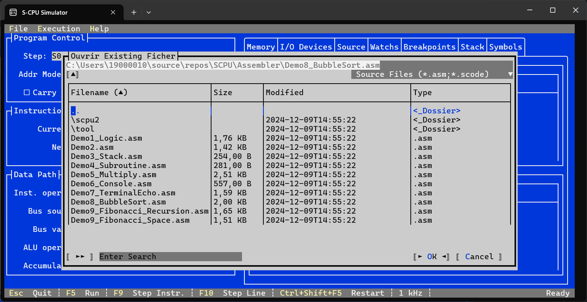
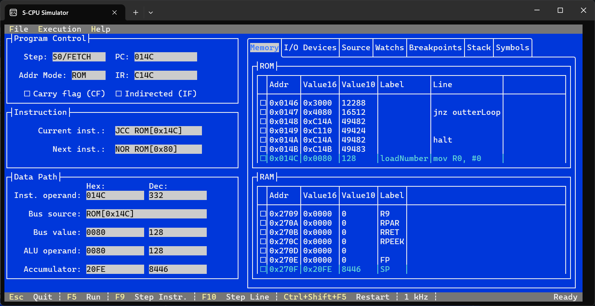
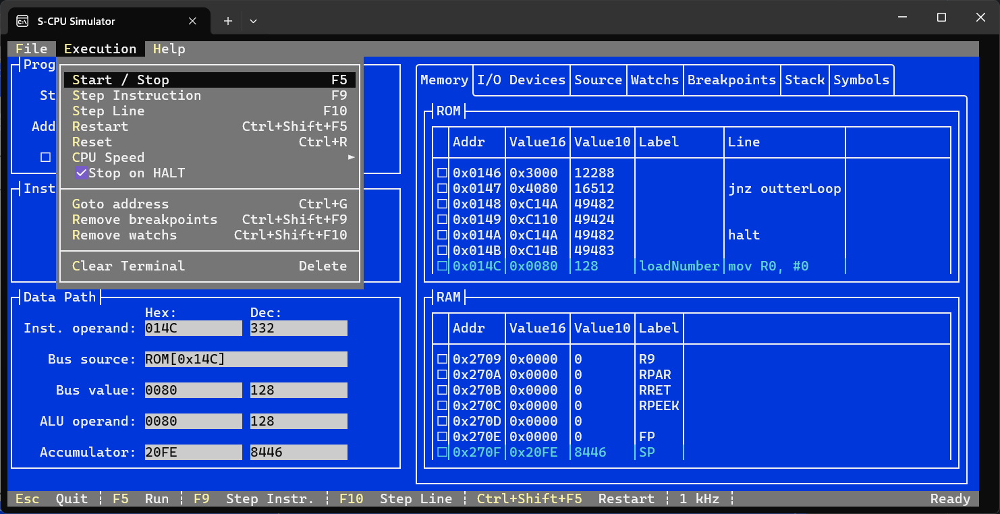
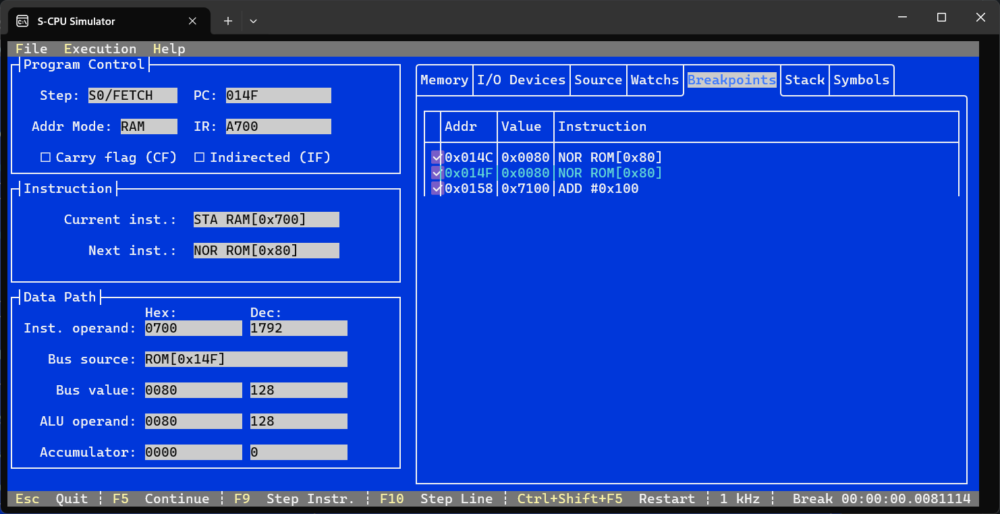
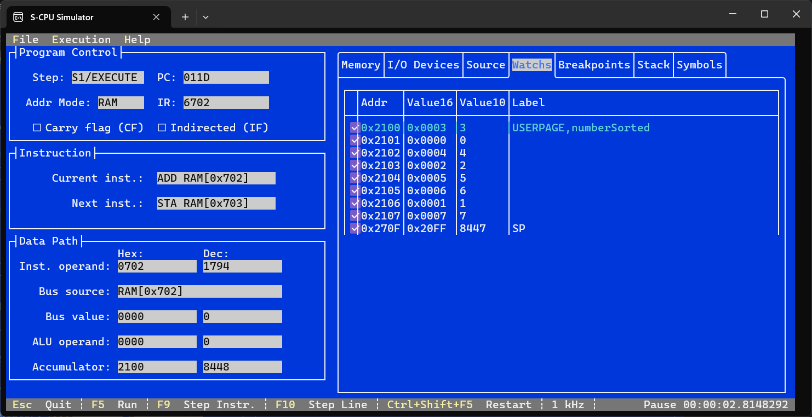
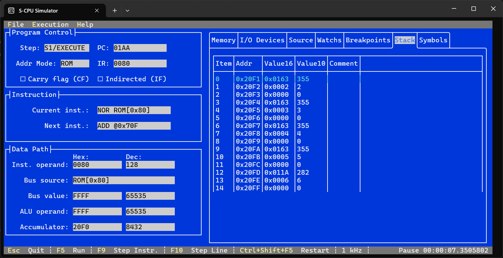
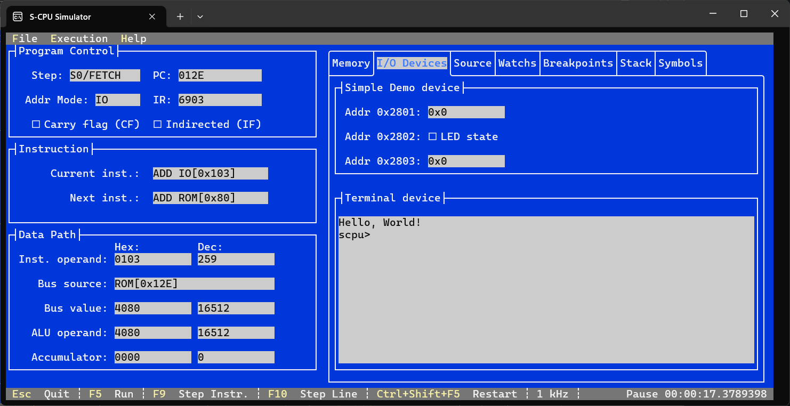
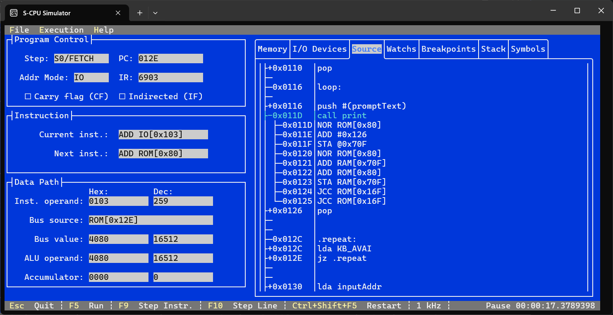
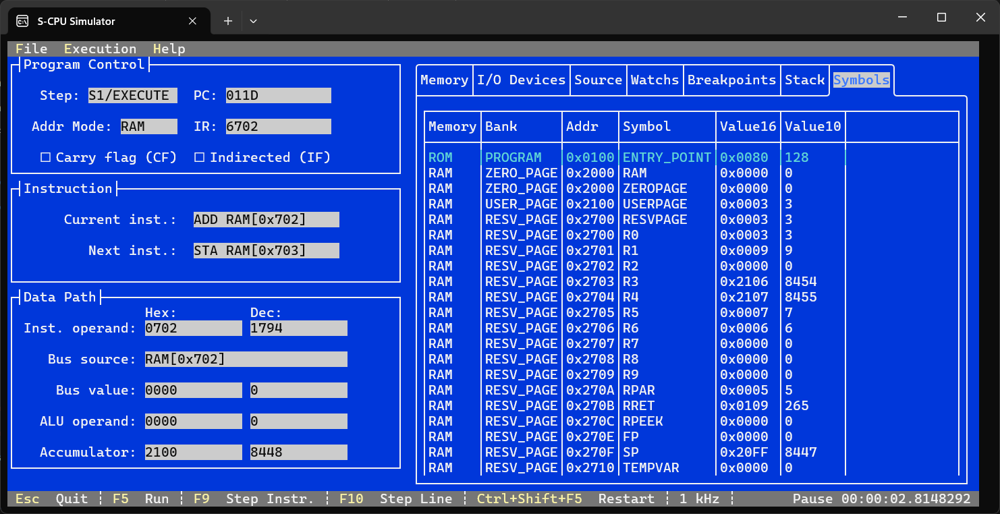

# Simulator V1

⚠️ **LEGACY / NOT MAINTAINED ANYMORE**  
This folder contains the first version of the S-CPU Simulator using [Terminal.Gui](https://github.com/gui-cs/Terminal.Gui).  
It is preserved **for reference only**. The new simulator 2.0 is now implemented under [`software/simulator`](../../software/simulator).  

The simulator is a console-based application that allows you to load either a binary ROM file or assemble an ASM source file at startup.

You can also load a ROM or ASM file directly via command-line arguments: `SCPU.Simulator.ConsoleUI.exe <filepath>`.

Shortcuts:
* `ESC` : Quit the simulator
* `F1` : Open the menubar
* `Ctrl+O` : Open a new file (either a ROM binary or ASM source)
* `Ctrl+F5` : Reload the current file
* You can export the ROM to binary, Intel HEX, or Logisim format from the `File > Export` menu

## Usage

On the main screen, you will find:
* Program Control: Displays the Program Counter, Step Counter, Instruction Register, and flags (IF & CF).
* Current & Next Instructions: Shows the decoded instructions.
* Data Path: Includes the instruction operand, data In & Out, and the accumulator register.

In the first tab, `Memory`, you can browse the ROM and RAM, along with associated labels (symbols) and ASM lines (if available).

For each ROM address, you can set a breakpoint, and for each RAM address, you can add a watch by checking the appropriate box.

From the menu bar `Execution`:
* `F5` : Start/Stop the clock
* `F9` : Step through instructions
* `F10` : Step through the source code line by line
* `Ctrl+R` : Restart the program (Reset then Start)
* `Ctrl+Shift+F5` : Reset the CPU
* `CPU Speed` : Adjust the CPU clock speed
* `Stop on HALT` : By default, the simulation automatically stops when a HALT instruction is encountered.

At the bottom right of the status bar, the simulation state (running, paused, halted) and the total execution time of the program are displayed in real time.

You can also search for an address or symbol using `Ctrl+G`.

## Breakpoints

All active breakpoints are listed in the Breakpoints tab. To remove a breakpoint, simply uncheck its box.

The clock halts whenever the Program Counter hits a breakpoint. Press `F5` to resume execution.

Tip: Use `Ctrl+Shift+F9` to remove all breakpoints.

## Watches

All active watches are listed in the Watches tab. You can remove a watch by unchecking its box.

Watches enable you to monitor the values of specific RAM addresses.

Tip: Use `Ctrl+Shift+F10` to remove all watches.

## Stack

This tab displays the current state of the stack, as stored in RAM.

## I/O Devices

This tab represents the I/O devices. Device #0 includes two 16-bit HEX displays and one LED (address 0x28xx), while device #1 is an ASCII terminal (address 0x29xx).

## Source Explorer

The Source Explorer tab shows the assembled source code, along with the corresponding memory addresses and instructions for each line.

## Symbols Explorer

The Symbols Explorer lists all the symbols and their real-time memory values.

