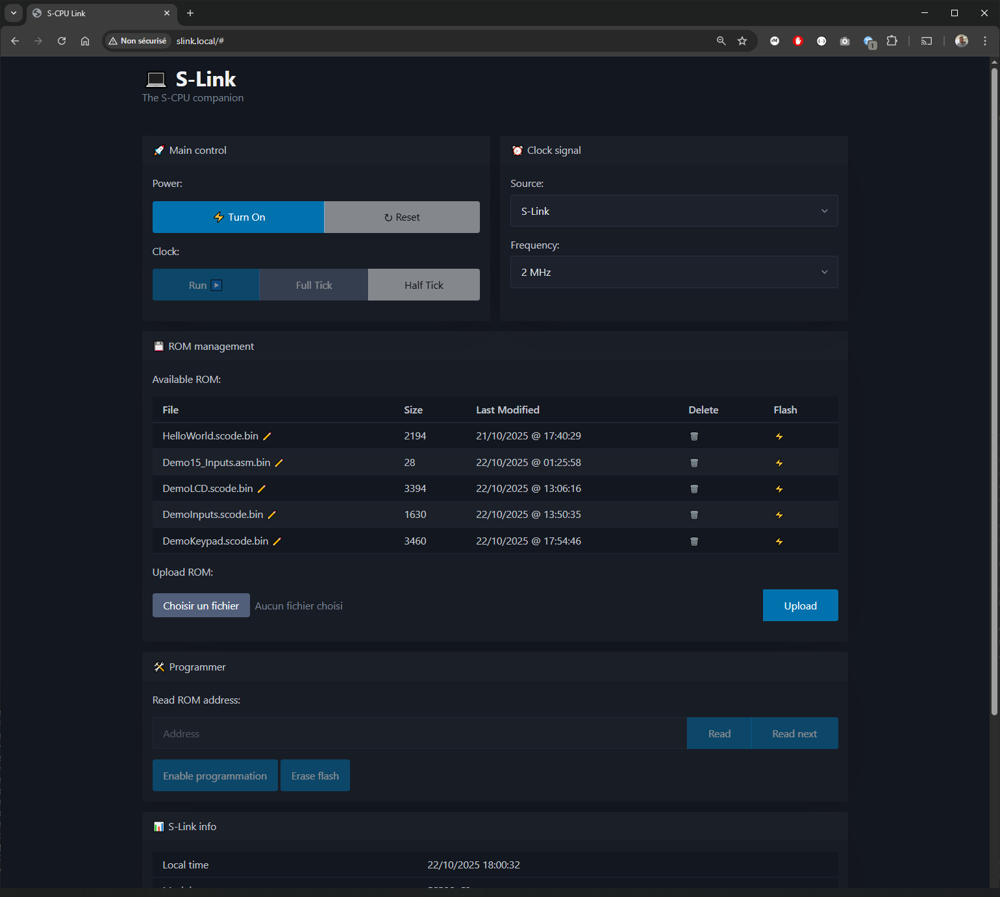

# S-Link Firmware V1 (Legacy)

⚠️ **LEGACY / NOT MAINTAINED ANYMORE**  
This folder contains the **first version** of the S-Link firmware, based on **PCF8574 I/O expanders** and **74HC595 shift registers** for ROM programming.  
It is preserved **for historical and reference purposes only**.  
The actively maintained version — **S-Link 2.x** — is now implemented under [`firmware/slink`](../../firmware/slink).

⚡ **S-Link** is the **control and programming interface** for the [**S-CPU TTL**](../../hardware/scpu-ttl/), giving users full control of the processor directly from a **web browser**.

It provides tools to **power on/off**, **reset**, **manage the clock**, **program the ROM**, and **monitor system status** — all through an intuitive web dashboard and HTTP API.


## Status

✅ Fully functional and stable  
🐢 Slow ROM programming speed (reason for redesign in V2)  
🚀 Replaced by **S-Link 2.x**, which uses **MCP23S17 SPI expanders** for improved performance

## 🧩 Overview

S-Link is the entry point to the S-CPU TTL ecosystem. From any computer or smartphone, it allows you to:

| Capability           | Description                                                                                      |
| -------------------- | ------------------------------------------------------------------------------------------------ |
| **Power Control**    | Turn the S-CPU on or off remotely.                                                               |
| **Master Reset**     | Perform a full system reset.                                                                     |
| **Clock Management** | Choose between hardware (NE555) or software-generated clock, adjust frequency, or tick manually. |
| **ROM Programming**  | Upload, erase, and flash ROM images directly from the browser.                                   |
| **Live Monitoring**  | View system status and programming progress in real time.                                        |

## 🌐 Web Interface

Once connected to your Wi-Fi network, S-Link automatically registers itself via **mDNS**. You can access the interface directly at:

👉 **[http://slink.local](http://slink.local)**

A built-in web dashboard (served by the S-Link firmware) provides full control of the S-CPU through any browser.



**Frontend stack:**

* [PicoCSS](https://picocss.com) for minimalist design
* [AngularJS](https://angularjs.org) for dynamic controls and API access

The interface uses:

* An **HTTP API** for control operations
* A **Server-Sent Events (SSE)** channel for live progress and status updates

## 🧠 HTTP API Reference

| Method   | Route                                     | Description                                                     |
| -------- | ----------------------------------------- | --------------------------------------------------------------- |
| **GET**  | `/status`                                 | Get current S-Link and S-CPU state (power, clock, programming). |
| **GET**  | `/sysinfo`                                | Retrieve ESP32 system info (Wi-Fi, memory, SPIFFS).             |
| **GET**  | `/control/reset`                          | Trigger a system reset.                                         |
| **GET**  | `/control/power?state=bool`               | Power ON/OFF the S-CPU.                                         |
| **GET**  | `/control/clock?src=enum&freq=int`        | Select clock source and frequency. |
| **GET**  | `/control/tick`                           | Advance one clock tick (step mode).                             |
| **GET**  | `/programming?state=bool`                 | Enter or exit programming mode.                                 |
| **GET**  | `/programming/write?address=int&data=int` | Write a word to a given ROM address.                            |
| **GET**  | `/programming/erase`                      | Erase the entire flash memory.                                  |
| **GET**  | `/roms`                                   | List, rename, delete, or flash stored ROM images.               |
| **POST** | `/upload`                                 | Upload new ROM images to SPIFFS.                                |

During flash or erase operations, progress is streamed via **SSE** — one event per written word.

## 🧰 Development

### Project Structure

| Folder           | Description                       |
| ---------------- | --------------------------------- |
| `src/`           | Firmware source code and classes. |
| `include/`       | Header files.                     |
| `data/`          | Web UI assets                     |
| `platformio.ini` | PlatformIO configuration.         |

### Build & Upload

```bash
# Build firmware
pio run

# Flash to ESP32 (via USB/Serial)
pio run --target upload

# Open serial monitor
pio device monitor
```

## ⚙️ Under the Hood

S-Link runs on an **ESP32-C3** that directly interfaces with the **S-CPU TTL** hardware.

### Hardware Connections

Nearly all I/O signals between S-Link and the S-CPU are handled through two **I²C GPIO expanders ([PCF8574](../../docs/datasheets/PCF8574.PDF))**.
Only the **clock output** uses a **dedicated PWM pin (GPIO 6)**, allowing high-frequency generation up to several MHz.

#### GPIO Summary

| GPIO           | Function    | Description                                                           |
| -------------- | ----------- | --------------------------------------------------------------------- |
| **GPIO 4 / 5** | I²C SDA/SCL | Communication with two PCF8574 expanders (3.3 V ↔ 5 V level-shifted). |
| **GPIO 6**     | PWM Clock   | Software clock output for the S-CPU (10 Hz – 4 MHz).                  |

#### I²C Level Shifting

I²C signals pass through a **bi-directional level shifter**, since the ESP32 operates at **3.3 V** and the S-CPU TTL logic at **5 V**.

### 🧩 Core Components

The firmware is structured around three main modules working together to control and program the S-CPU TTL.

#### `main.cpp`

The central entry point of the firmware.
It configures the **AsyncWebServer** to:

* Serve the S-Link web interface (standalone HTML page from SPIFFS)
* Expose all **REST API routes** for power, clock, programming, and ROM management

It also initializes an **AsyncEventSource** channel used for **Server-Sent Events (SSE)** to stream real-time updates (e.g. programming progress, system status) to the browser.
All interactions between the web API, `SLink`, and `FlashProgrammer` are coordinated here.

#### `SLink` Class

High-level controller that manages the overall S-CPU state.
It provides methods to:

* Control power (relay) and master reset
* Manage clock source selection and PWM generation (10 Hz–4 MHz)
* Execute manual clock ticks (half/full cycle)
* Enter and exit programming mode safely

It acts as the **main control abstraction** used by the web API to interact with the S-CPU hardware.

#### `FlashProgrammer` Class

Low-level component dedicated to ROM programming.
It handles:

* Address and data shifting through 74HC595 registers (via PCF8574 expanders over I²C)
* SST39 flash command sequences (Byte-Program, Chip-Erase)

Progress reporting to the web interface is **coordinated by `main.cpp`**, which captures updates and streams them via SSE.

### 🧠 PCF8574 #1 — `PCF_MST` (0x21)

**Main control expander**: power, reset, clock source, and programming enable.

| Pin    | Signal      | Description                                          |
| ------ | ----------- | ---------------------------------------------------- |
| **P0** | `PROG_EN`   | Activates programming mode.                          |
| **P1** | `RESET`     | Active-LOW system reset (50 ms pulse).               |
| **P2** | `CLK_SRC`   | Selects between ESP32 clock or NE555 hardware clock. |
| **P7** | `PSU_RELAY` | Powers the S-CPU via a relay (active LOW).           |

🟢 **Power-on sequence for the S-CPU**:

* `PSU_RELAY = LOW` → Relay ON (CPU powered)
* `CLK_SRC = HIGH` → ESP32 clock selected
* `RESET = HIGH` → CPU running
* `PROG_EN = LOW` → Programming disabled

Clock signal is generated with the ESP32 LEDC PWM API:

```cpp
ledcSetup(channel, frequency, resolutionBits);
ledcAttachPin(GPIO_NUM_6, channel);
ledcWrite(channel, dutyCycle);
```

### 💾 PCF8574 #2 — `PCF_ROM` (0x20)

**ROM programming control**, driving four chained 74HC595 shift registers:

* Two for **address lines** (shared by both ROMs)
* Two for **data lines** (one for MSB, one for LSB)

| Pin | Signal        | Role                                       |
| --- | ------------- | ------------------------------------------ |
| P0  | `SERIAL_DATA` | Serial data input to all 74HC595.          |
| P1  | `ADDR_RCLK`   | Latch for address registers.               |
| P2  | `ADDR_SRCLK`  | Shift clock for address registers.         |
| P3  | `DATA_RCLK`   | Latch for data registers.                  |
| P4  | `DATA_SRCLK`  | Shift clock for data registers.            |
| P5  | `DATA_OE`     | Enable data register outputs (active LOW). |
| P6  | `ROM_OE`      | Disable SST39 output (active LOW).         |
| P7  | `ROM_WE`      | Write enable for SST39 (active LOW).       |

### 🧬 Programming Sequence

1. Clock is stopped
2. `PROG_EN` set HIGH → ROM addresses are switched to the 74HC595 outputs.
3. `ROM_OE` set LOW → ROM outputs disabled (data bus becomes input).
4. `DATA_OE` set LOW → 74HC595 drives data lines.
5. The firmware shifts address and data serially into the registers.
6. `ROM_WE` toggled LOW/HIGH to perform write pulses.

Programming follows the **SST39SF Byte-Program Operation** procedure ([Datasheet](../../docs/datasheets/SST39SF.pdf)).

## 🚧 Future Improvements

S-Link already covers power, clock, and ROM control — next steps aim to extend interaction and debugging capabilities:

* **🖥️ MMIO Terminal**
  Implement a memory-mapped I/O device on the S-CPU acting as a text terminal.

* **💻 Integrated Web IDE**
  Embed a browser-based code editor (e.g. CodeMirror) with WebAssembly builds of the S-CPU Assembler and S-Code Compiler to write, compile, and flash code directly in S-Link.

* **🧩 Memory Viewer**
  Enable ROM and RAM readback for memory dumps and live debugging.

## 🔗 Related Projects

* **[S-Link 2.x](../../firmware/slink)** — current firmware.
* **[S-CPU TTL Hardware](../../hardware/scpu-ttl/)** — schematic and wiring.
* **[S-CPU Assembler](../../software/assembler/)** — converts assembly to machine code.
* **[S-Code Compiler](../../software/compiler/)** — compiles high-level S-Code into S-CPU assembly.
* **[S-CPU Simulator](../../software/simulator/)** — software emulator of the CPU pipeline.
