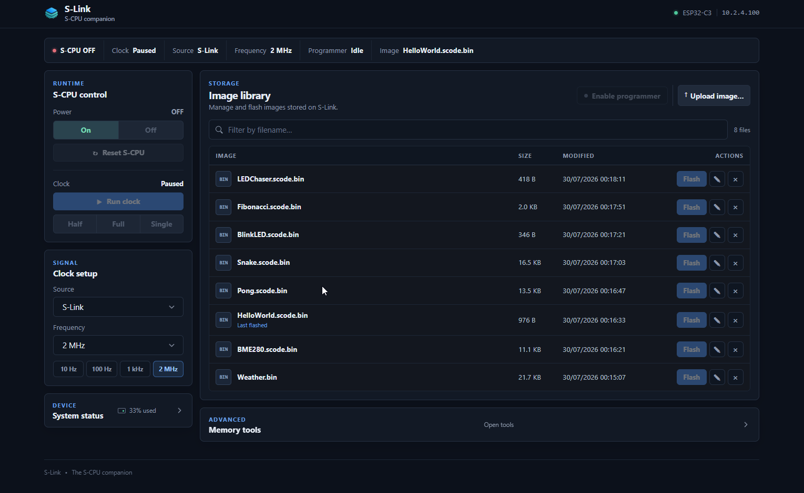
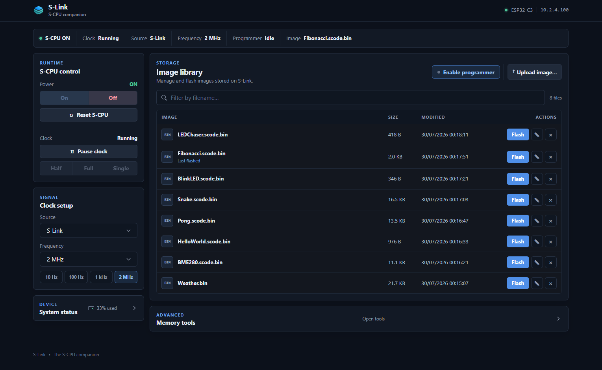
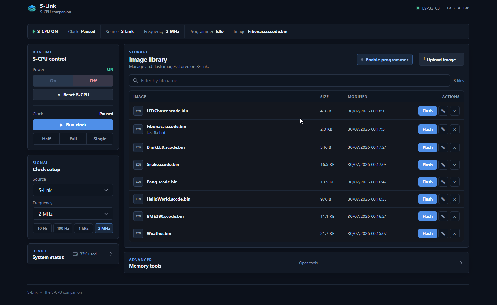

# S-Link Firmware

⚡ **S-Link** is the browser-based **control and programming companion** for the [**S-CPU TTL**](../../hardware/scpu-ttl/).

It provides tools to **power on or off**, **reset**, **manage the clock**, **program the ROM**, **inspect memory**, and **monitor system status** through a built-in web dashboard and HTTP API.

## Overview

From a computer or smartphone on the same network, S-Link provides:

| Capability           | Description                                                                                      |
| -------------------- | ------------------------------------------------------------------------------------------------ |
| **Power Control**    | Turn the S-CPU on or off remotely.                                                               |
| **Master Reset**     | Perform a full system reset.                                                                     |
| **Clock Management** | Control the clock-source multiplexer, choose the standalone NE555 or ESP32-generated PWM signal, adjust frequency, or tick manually. |
| **ROM Programming**  | Upload, erase, and flash ROM images directly from the browser.                                   |
| **Memory Inspection** | Read ROM/RAM, capture the complete RAM, inspect CPU registers, and decode the active stack.      |
| **Live Monitoring**  | View system status and programming progress in real time.                                        |

## Web Interface

Once connected to your Wi-Fi network, S-Link automatically registers itself via **mDNS**. You can access the interface directly at:

👉 **[http://slink.local](http://slink.local)**

A built-in web dashboard (served by the S-Link firmware) provides full control of the S-CPU through any browser.


**Frontend stack:**

* [PicoCSS](https://picocss.com) for the base visual system.
* [AngularJS](https://angularjs.org) for dynamic controls and API integration.

The interface uses:

* An **HTTP API** for control operations
* A **Server-Sent Events (SSE)** channel for live progress and status updates

### Runtime Control

Power, reset, clock source, frequency, and manual stepping are controlled
directly from the dashboard:



### ROM Flash Workflow

Flashing a ROM image to the S-CPU follows three steps:

**1. Confirm flash** — select the image and optionally enable auto-run (reset and start the clock after successful verification)

**2. Live progress** — monitor the inline progress bar and transfer speed

**3. Result** — review the completion summary, including file, size, duration, speed, and auto-run status


### Memory Tools

The **Memory viewer**, available below the image library, lets you inspect both ROM and RAM directly from the browser.

ROM and RAM provide two common representations:

- **Hex** — an eight-column, 16-bit big-endian word view with synchronized hexadecimal and ASCII selection.
- **JSON** — the raw API response.

For RAM, a third representation is available:

- **Inspector** — a decoded view of the S-CPU runtime layout stored in RAM, including runtime registers, memory regions, and stack frames.

ROM and RAM can be read in blocks of up to 2048 words. Previous/next navigation advances by the selected block size, and complete binary downloads are available for both memories.

#### ROM and RAM Hex View

The Hex view is available for both memories:



#### RAM Capture and Inspector

**Capture RAM** reads all 2048 words while programming mode owns the buses.
The resulting snapshot feeds the Inspector, Hex, and JSON views without another hardware read.

The Inspector interprets the RAM contents according to the S-CPU runtime memory layout:



| RAM offset | CPU address | S-CPU virtual address | Region |
| ---------- | ----------- | --------------------- | ------ |
| `0x000–0x0FF` | `0x2000–0x20FF` | `0x12000–0x120FF` | Stack |
| `0x100–0x6FF` | `0x2100–0x26FF` | `0x12100–0x126FF` | User page |
| `0x700–0x7FF` | `0x2700–0x27FF` | `0x12700–0x127FF` | Reserved/runtime data |

The default display convention is the **CPU address** (`0x2000–0x27FF`), matching the 16-bit values stored in `SP` and `FP`. The Inspector can instead display S-CPU virtual addresses or direct RAM offsets.

The reserved runtime area includes:

| RAM offset | Register |
| ---------- | -------- |
| `0x700–0x709` | `R0–R9` |
| `0x70A` | Parameter register |
| `0x70B` | Return-address register |
| `0x70C` | Peek register |
| `0x70E` | Frame Pointer (`FP`) |
| `0x70F` | Stack Pointer (`SP`) |
| `0x710…` | Runtime temporary variables |

The stack grows toward lower addresses. From the runtime values stored in RAM,
the Inspector identifies `SP`, `FP`, saved frame pointers, and return addresses,
then follows valid saved-FP links to reconstruct the frame chain. Clicking a
runtime register, memory region, frame, or stack entry opens the corresponding
location in the Hex view.

### Programming Mode and Clock Isolation

ROM and RAM access require exclusive control of the S-CPU buses. Entering programming mode:

1. stops S-Link PWM generation;
2. physically selects the S-Link clock path and holds its clock GPIO LOW, isolating the NE555 even when NE555 remains the configured source;
3. enables `PROG_EN`, disconnecting the Program Counter and Instruction Register from the address bus;
4. gives the MCP23S17 interfaces control of the address and data buses.

Entering programming mode does **not** reset the S-CPU. Its registers, current execution state, and RAM contents are preserved, allowing a pause → RAM capture → resume workflow.

The configured clock source is also preserved for restoration. For example:

```text
Clock: Paused
Source: NE555
Frequency: Isolated
```

Here, `NE555` is the saved configuration while `Isolated` describes the physical clock state. When leaving programming mode, S-Link first releases the programmer data path and memory outputs, then returns the buses to the S-CPU, and finally restores the configured clock source. RAM cannot be captured while the S-CPU is running.

A successful flash with **Run after flash** exits programming mode while holding RESET active, restores the configured clock path, and then releases RESET. S-Link PWM is started when selected; NE555 resumes from the clean reset state when selected. A failed or unverified flash remains in programming mode so the CPU cannot resume against a potentially incomplete ROM.

## HTTP API Reference

| Method   | Route                                     | Description                                                     |
| -------- | ----------------------------------------- | --------------------------------------------------------------- |
| **GET**  | `/status`                                 | Get current S-Link and S-CPU state (power, clock, programming). |
| **GET**  | `/sysinfo`                                | Retrieve ESP32 system info (Wi-Fi, memory, SPIFFS).             |
| **POST** | `/control/power?state=bool`               | Power ON/OFF the S-CPU.                                         |
| **POST** | `/control/reset`                          | Reset the S-CPU state, including registers and program counter. |
| **POST** | `/control/clock?source=enum&frequency=int&auto=bool` | Select clock source, frequency, and auto tick mode. |
| **POST** | `/control/tick?full=bool`                 | Advance one clock tick (step mode).                             |
| **POST** | `/programming/state?state=bool`         | Enter or exit programming mode.                                 |
| **GET**  | `/rom/read?address=int&count=int`       | Read one or more ROM words (count optional, max 2048).          |
| **GET**  | `/rom/dump.bin`                         | Stream the complete 64K-word ROM as big-endian binary.          |
| **POST** | `/rom/write?address=int&data=int`       | Write one ROM word at address.                                  |
| **POST** | `/rom/erase`                            | Erase the entire flash memory.                                  |
| **GET**  | `/ram/read?address=int&count=int`         | Read RAM words from address (count optional, default 1).        |
| **POST** | `/ram/write?address=int&data=value`       | Write RAM word(s): single value, CSV, or packed hex words.      |
| **POST** | `/ram/fill?value=value`                   | Fill entire RAM (2K words) with 0x0000 or 0xFFFF (default 0).   |
| **GET**  | `/ram/dump.bin`                           | Dump full RAM as raw binary (4096 bytes).                        |
| **GET**  | `/ram/dump`                               | Dump full RAM content (2K words).                               |
| **POST** | `/ram/upload?file=name&address=int`       | Copy a SPIFFS ROM file into RAM at address (default 0).         |
| **GET**  | `/images`                                 | List stored ROM images from SPIFFS.                             |
| **DELETE** | `/images/file?name=filename`            | Delete one ROM image from SPIFFS.                               |
| **POST** | `/images/rename?file=old&newName=new`     | Rename one ROM image in SPIFFS.                                 |
| **POST** | `/images/flash?file=name&autoRun=bool`    | Start a ROM flash job; after successful verification, `autoRun=true` resets the S-CPU and resumes the configured clock source. |
| **POST** | `/images/upload`                          | Upload new ROM images to SPIFFS.                                |

During flash or erase operations, progress is streamed via **SSE** — one event per written word.

Direct ROM and RAM access requires programming mode to own the address and data buses. Memory endpoints return HTTP `409` when a flash job is already in progress.

Memory endpoint addresses are raw ROM/RAM **word offsets**. For RAM, API address `0x000` corresponds to CPU address `0x2000` and S-CPU virtual address `0x12000`.

### Reliability Notes

- SST39 program timeout: `500 ms` per programmed word (data polling).
- SST39 chip erase timeout: `10 s`.
- Write Operation Status Detection: after each program/erase command, firmware polls ROM readback until expected data is observed (or timeout), then switches back to write mode for the next word.
- SPI write/control failures abort operations gracefully (HTTP `500` for direct API writes, failed job report for background flash).

## Development

### Project Structure

| Folder           | Description                       |
| ---------------- | --------------------------------- |
| `src/`           | Firmware source code and classes. |
| `include/`       | Header files.                     |
| `data/`          | Web UI assets                     |
| `platformio.ini` | PlatformIO configuration.         |

### Build & Upload

```bash
# Build firmware
pio run

# Build the SPIFFS image containing the web UI
pio run --target buildfs

# Flash to ESP32 (via USB/Serial)
pio run --target upload

# Upload the web UI to SPIFFS
pio run --target uploadfs

# Open serial monitor
pio device monitor
```

Automatic validation runs through Gitea Actions on push and pull request via [.gitea/workflows/platformio-ci.yml](.gitea/workflows/platformio-ci.yml).

## Under the Hood

S-Link runs on an **ESP32-C3** that interfaces with the **S-CPU TTL** control, address, and data buses. The ESP32 remains outside the CPU datapath and is used only for supervision and programming.

### Hardware Connections

All control and data signals between S-Link and the S-CPU are managed through **three SPI-connected MCP23S17 GPIO expanders**, providing **48 parallel I/O pins** at high speed.
The **clock output** uses a **dedicated PWM pin (GPIO 8)**, enabling software-controlled clock generation from 10 Hz up to 5 MHz. S-Link also controls the external multiplexer that selects either this PWM signal or the standalone NE555 oscillator.

#### ESP32 Interface Configuration

| Signal    | ESP32-C3 Pin | Interface       | Description                                                  |
|-----------|--------------|-----------------|--------------------------------------------------------------|
| **CS**    | GPIO 7       | Level shifter   | Chip select to all 3 × MCP23S17 (3.3 V → 5 V via 74AHCT125)   |
| **SCK**   | GPIO 4       | Level shifter   | SPI clock to MCP23S17 (3.3 V → 5 V via 74AHCT125)            |
| **MOSI**  | GPIO 6       | Level shifter   | Data out to MCP23S17 (3.3 V → 5 V via 74AHCT125)             |
| **MISO**  | GPIO 5       | Voltage divider | Data in from MCP23S17 (5 V → 3.3 V through 2.2 kΩ + 1 kΩ)   |
| **Clock** | GPIO 8       | Direct PWM      | Software clock output for the S-CPU (10 Hz–5 MHz)           |

**Level Shifting:**
- **MOSI, SCK, CS:** 74AHCT125 buffers (3.3 V → 5 V, all ~OE tied to GND except gate 4 unused)
- **MISO:** Voltage divider (2.2 kΩ + 1 kΩ to GND) for 5 V → 3.3 V

#### MCP23S17 Expanders

Three MCP23S17 devices handle all control, address, and data signals:

| Device        | Hardware address | Purpose                      | Pin Convention      |
|---------------|----------|------------------------------|---------------------|
| **MCP_CTRL**  | 0x00     | Control signals (PROG_EN, RESET, etc.) | 16 bits: GPIO A0–A7, B0–B7 |
| **MCP_ADDR**  | 0x01     | 16-bit address bus           | Port A = LSB (bits 0–7), Port B = MSB (bits 8–15) |
| **MCP_DATA**  | 0x02     | 16-bit data bus (bidirectional) | Port A = LSB (bits 0–7), Port B = MSB (bits 8–15) |

Each expander provides 16 GPIO pins (two 8-bit ports: A and B).

### Core Components

The firmware is structured around four main components working together to expose the web application and safely control the S-CPU TTL hardware.

#### `main.cpp`

The application coordinator and HTTP entry point. It is responsible for:

- starting the device services and serving the web interface;
- exposing the REST API and validating requests;
- managing ROM images and coordinating flash jobs;
- publishing live state and progress through Server-Sent Events.

#### `SLink` Class

The high-level controller for the S-CPU. It provides:

- power and reset control;
- clock generation, source selection, and manual stepping;
- the current machine and programming-mode state;
- safe transitions between normal execution and programming mode.

#### `FlashProgrammer` Class

The ROM and RAM transaction engine. It handles:

- ROM erase, programming, reading, and verification;
- RAM read and write operations;
- switching between safe read, write, and disabled bus states;
- the low-level memory operations used by flash jobs and the Memory Viewer.

#### `MCPManager` Class

The hardware abstraction for the three SPI-connected MCP23S17 expanders. It provides:

- initialization and access to the control, address, and data expanders;
- named control-signal operations for higher-level components;
- 16-bit address and data bus transfers;
- data-bus direction management and basic SPI error handling.

### MCP23S17 Control Signals — `MCP_CTRL` (Hardware Address 0x00)

The control expander manages power, reset, clock, programming mode, and bus transceiver direction.

| Bit | Signal              | Type       | Description                                                              |
|-----|---------------------|-------------|--------------------------------------------------------------------------|
| 0   | `PROG_EN`           | Active HIGH | Activates ROM programming mode: routes MCP_ADDR to ROM address lines, disconnects Program Counter and Instruction Register from address bus. |
| 1   | `RESET`             | Active LOW  | Master reset signal (pulse 50 ms for full reset).                       |
| 2   | `CLK_SRC`           | Binary      | Clock source selection: LOW = NE555 hardware clock, HIGH = ESP32 PWM clock. |
| 3   | `PSU_RELAY`         | Active LOW  | Powers the S-CPU via relay; LOW = power ON, HIGH = power OFF.           |
| 4   | `DATA_TRX_EN`       | Active LOW  | Enables the 74LS245 buffers on the data bus; LOW = active, HIGH = inactive. |
| 6   | `DATA_TRX_DIR`      | Binary      | Transceiver direction: LOW = MCP writes to bus, HIGH = MCP reads from bus. Requires MCP_DATA GPIO reconfiguration as output or input. |
| 8   | `ROM_WE`            | Active LOW  | Write enable for SST39 ROM; LOW = perform write pulse, HIGH = idle.    |
| 9   | `ROM_OE`            | Active HIGH | Output enable for SST39 ROM; inverted by 74x04. HIGH = ROM outputs on bus, LOW = ROM outputs disabled. |
| 12  | `RAM_OE`            | Active HIGH | Output enable for UT6264C RAM; inverted by 74x04. HIGH = RAM outputs on bus, LOW = RAM outputs disabled. |
| 13  | `RAM_WE`            | Active LOW  | Write enable for UT6264C RAM; LOW = perform write pulse, HIGH = idle.  |

**Power-on Sequence:**

```
PSU_RELAY = LOW      → Relay ON (CPU powered)
CLK_SRC = HIGH       → ESP32 clock selected
RESET = HIGH         → CPU running
PROG_EN = LOW        → Programming mode disabled (PC/IR control address bus)
DATA_TRX_EN = HIGH   → Data transceiver inactive (SCPU controls data bus)
```

### MCP23S17 Address Bus — `MCP_ADDR` (Hardware Address 0x01)

The address expander provides a **16-bit parallel address bus** directly to the ROM and RAM.

| Port | Pins    | Bits   | Function                  | Hardware Path                    |
|------|---------|--------|---------------------------|----------------------------------|
| A    | A7–A0   | 0–7    | Address LSB (bits 0–7)    | 74LS245 #1 → ROM/RAM addr pins  |
| B    | B7–B0   | 8–15   | Address MSB (bits 8–15)   | 74LS245 #2 → ROM/RAM addr pins  |

**74LS245 Configuration:**
- Both buffers have **direction fixed at LOW** (MCP → bus, always unidirectional)
- **~E (chip enable)** tied to `PROG_EN` from MCP_CTRL
  - When `PROG_EN = HIGH`: 74LS245 buffers are active, MCP_ADDR drives the address bus
  - When `PROG_EN = LOW`: 74LS245 buffers are inactive, S-CPU's PC/IR control the address bus

### MCP23S17 Data Bus — `MCP_DATA` (Hardware Address 0x02)

The data expander provides a **16-bit bidirectional data bus** for reading and writing both ROM and RAM.

| Port | Pins    | Bits   | Function                  | Hardware Path                    |
|------|---------|--------|---------------------------|----------------------------------|
| A    | A7–A0   | 0–7    | Data LSB (bits 0–7)       | 74LS245 #1 → ROM/RAM data bus   |
| B    | B7–B0   | 8–15   | Data MSB (bits 8–15)      | 74LS245 #2 → ROM/RAM data bus   |

**74LS245 Configuration:**
- **~E (chip enable)** controlled by `DATA_TRX_EN` from MCP_CTRL (Active LOW)
  - When `DATA_TRX_EN = LOW`: Buffers are active, MCP_DATA drives the data bus
  - When `DATA_TRX_EN = HIGH`: Buffers are inactive, S-CPU controls the data bus
- **DIR (direction)** controlled by `DATA_TRX_DIR` from MCP_CTRL
  - `DATA_TRX_DIR = LOW`: MCP_DATA outputs to bus (write mode) — MCP ports configured as OUTPUT
  - `DATA_TRX_DIR = HIGH`: MCP_DATA reads from bus (read mode) — MCP ports configured as INPUT

**Mode Switching Sequence:**
```
To switch to WRITE mode:
  1. setCtrl(CTRL_PIN_DATA_TRX_DIR, LOW)    // Set direction to write
  2. setDataBusMode(DATA_BUS_WRITE)         // Configure MCP_DATA as output (0x0000)
  
To switch to READ mode:
  1. setCtrl(CTRL_PIN_DATA_TRX_DIR, HIGH)   // Set direction to read
  2. setDataBusMode(DATA_BUS_READ)          // Configure MCP_DATA as input (0xFFFF)
```

### ROM Programming Sequence

Programming the paired SST39 ROM devices follows the **Byte-Program Operation** from the SST39SF datasheet. The same command byte is applied to both chips while the 16-bit data word is split across the high-byte and low-byte devices:

**Setup:**
1. `PROG_EN = HIGH` → Routes MCP_ADDR to ROM address lines (disconnects PC/IR)
2. `DATA_TRX_EN = LOW` → Activates MCP_DATA on the data bus
3. `DATA_TRX_DIR = LOW` → Configures MCP_DATA as OUTPUT (write mode)
4. `ROM_OE = LOW` → Disables ROM output (safety)

**Chip Erase Command Sequence:**
```
Write 0xAAAA to address 0x5555  (unlock cycle 1)
Write 0x5555 to address 0x2AAA  (unlock cycle 2)
Write 0x8080 to address 0x5555  (chip erase command)
Write 0xAAAA to address 0x5555  (unlock cycle 1)
Write 0x5555 to address 0x2AAA  (unlock cycle 2)
Write 0x1010 to address 0x5555  (confirm erase)
Wait for completion
```

**Byte-Program Command Sequence (per address):**
```
Write 0xAAAA to address 0x5555  (unlock cycle 1)
Write 0x5555 to address 0x2AAA  (unlock cycle 2)
Write 0xA0A0 to address 0x5555  (byte program command)
Write DATA to target ADDRESS     (actual data)
Wait 30 µs for write pulse to complete
```

**Cleanup:**
1. `ROM_OE = HIGH` → Re-enables ROM output
2. `DATA_TRX_EN = HIGH` → Deactivates MCP_DATA (S-CPU controls bus)
3. `PROG_EN = LOW` → Routes PC/IR back to address bus

### ROM Readback Sequence

To verify programmed data:

**Setup:**
1. `PROG_EN = HIGH` → Routes MCP_ADDR to ROM address lines
2. `DATA_TRX_EN = LOW` → Activates MCP_DATA on the data bus
3. `DATA_TRX_DIR = HIGH` → Configures MCP_DATA as INPUT (read mode)
4. `ROM_OE = HIGH` → Enables ROM output

**Read Operation (per address):**
```
Write ADDRESS to MCP_ADDR       (place address on bus)
Wait 1 µs for address setup
Read DATA from MCP_DATA         (read data from ROM output)
```

**Cleanup:**
Same as ROM programming cleanup.

### RAM Read/Write Operations

RAM (UT6264C) supports the same addressing and data bus as ROM, with separate `RAM_OE` and `RAM_WE` signals.

**Write to RAM:**
```
PROG_EN = HIGH              (enable MCP_ADDR on address bus)
DATA_TRX_EN = LOW           (enable MCP_DATA on data bus)
DATA_TRX_DIR = LOW          (configure MCP_DATA as output)
RAM_WE = LOW, then HIGH     (pulse write enable)
```

**Read from RAM:**
```
PROG_EN = HIGH              (enable MCP_ADDR on address bus)
DATA_TRX_EN = LOW           (enable MCP_DATA on data bus)
DATA_TRX_DIR = HIGH         (configure MCP_DATA as input)
RAM_OE = HIGH               (enable RAM output)
Read from MCP_DATA
```

### Evolution: V1 to V2

**S-Link V1** used an **I²C + Serial Shift Register** architecture:
- **Expanders:** 2 × PCF8574 (I²C GPIO expanders)
- **Address/Data Buses:** 4 × 74HC595 shift registers (4 cascaded, serial shifting)
- **Level Shifting:** 1 × bidirectional level shifter modules (standard I²C compatible)
- **Performance:** ~44 bytes/second (extremely slow for ROM programming)

**Why V2?**
The V1 architecture's fundamental bottleneck was the **74HC595 shift register pipeline**. Each address and data word required:
1. Serial shifting of 16 bits through 4 cascaded registers (~µs per bit)
2. Latch pulse
3. I²C overhead for control signals

This made ROM programming **glacially slow** — a full 64K-word ROM image took roughly 25 minutes to program.

**S-Link V2** replaces this with **SPI + Direct Parallel I/O**:
- **Expanders:** 3 × MCP23S17 (SPI GPIO expanders) — **48 parallel pins**
- **Address/Data Buses:** Direct 16-bit parallel output (no shift registers needed)
- **Level Shifting:** 1 × 74AHCT125 high-speed buffers (SPI can handle MHz+ frequencies)
- **Performance:** ~29× faster (approximately 1290 B/sec, 1.26 KB/sec)

**Key Advantages:**

| Aspect | V1 (PCF8574 + 74HC595) | V2 (MCP23S17) |
|--------|------------------------|---------------|
| Protocol | I²C (100–400 kHz) | SPI (10+ MHz) |
| Address/Data | Serial shift (16 bits) | Parallel output (16 bits) |
| Shift delay | ~16 µs per word | ~1 µs per SPI transaction |
| ROM programming | ~22 words/s (~50 min/full image) | ~645 words/s (~1 min 41 sec/full image) |
| Level shifters | Bi-directional (slow) | 74AHCT125 (high-speed) |

**Legacy:** [S-Link V1 archive](../../archive/slinkV1/) contains the original I²C-based implementation.

## Future Improvements

S-Link already covers power, reset, clock management, ROM programming, and memory inspection. 
Future work can extend the platform toward richer runtime interaction and development workflows:

* **MMIO Terminal**
  Implement a memory-mapped I/O device on the S-CPU acting as a text terminal.

* **Integrated Web IDE**
  Embed a browser-based code editor (e.g. CodeMirror) with WebAssembly builds of the S-CPU Assembler and S-Code Compiler to write, compile, and flash code directly in S-Link.

## Related Projects

* **[S-CPU TTL Hardware](../../hardware/scpu-ttl/)** — schematic and wiring.
* **[S-CPU Assembler](../../software/assembler/)** — converts assembly to machine code.
* **[S-Code Compiler](../../software/compiler/)** — compiles high-level S-Code into S-CPU assembly.
* **[S-CPU Simulator](../../software/simulator/)** — software simulator of the CPU execution model.
