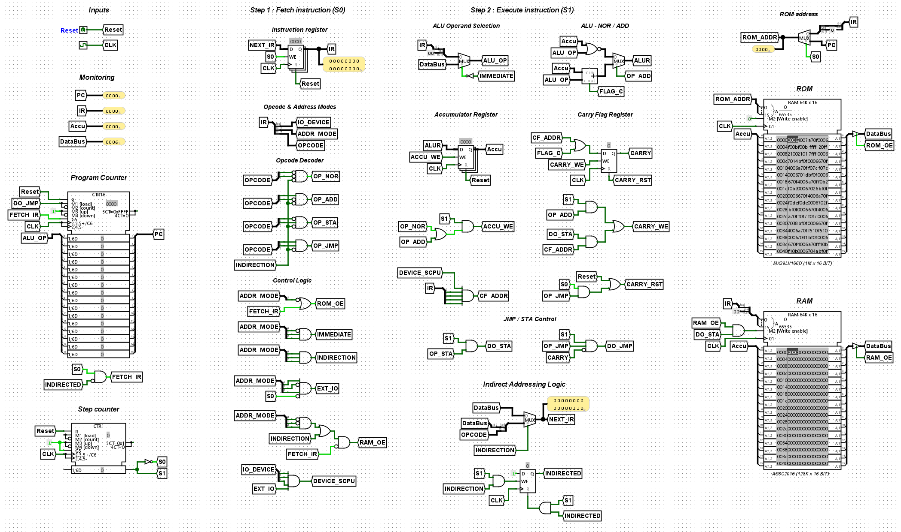
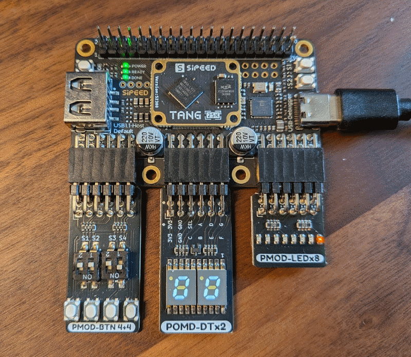

# S-CPU Hardware Implementations

This directory groups all hardware-oriented S-CPU targets, from circuit simulation to physical hardware.

For the fastest bring-up and debugging workflow, start with the software simulators before choosing a hardware target: [Desktop Simulator](../software/simulator/SCPU.Simulator.Desktop/README.md) or [CLI Simulator](../software/simulator/SCPU.Simulator.CLI/README.md).

## Overview

| Implementation | Best for | Documentation |
| --- | --- | --- |
| Logisim | Architecture design and first circuit-level validation | [hardware/logisim/](./logisim/) |
| Digital | TTL chip-level simulation close to physical wiring | [hardware/digital/](./digital/) |
| Verilog | Synthesizable RTL simulation and waveform analysis | [hardware/verilog/](./verilog/) |
| Gowin FPGA | High-speed execution on Tang Primer 25K | [hardware/gowin/](./gowin/) |
| S-CPU TTL | Physical 74xx breadboard computer | [hardware/scpu-ttl/](./scpu-ttl/) |

## Implementations

### 1. Logisim-evolution

The first implementation used to design and validate the S-CPU architecture: datapath, control logic, memory map, and MMIO behavior.

[Read the Logisim documentation](./logisim/README.md)

### 2. Digital (TTL simulation)

A 74xx-oriented chip-level simulation that mirrors real hardware construction more closely and serves as a practical reference for the TTL build.

[Read the Digital documentation](./digital/README.md)

### 3. Verilog RTL

A synthesizable RTL implementation used for automated simulation, waveform inspection, and as the architectural basis for the FPGA target.

[Read the Verilog documentation](./verilog/README.md)

### 4. Gowin FPGA (Tang Primer 25K)

The FPGA implementation of S-CPU, derived from the Verilog core and adapted to Gowin IP blocks, board clocking, and physical I/O.

[Read the Gowin documentation](./gowin/README.md)

### 5. S-CPU TTL (physical machine)

The physical 16-bit breadboard computer built with 74xx-series logic ICs, external ROM and RAM	, and [S-Link](../firmware/slink/) for power, clock, reset, and ROM programming.

[Read the S-CPU TTL documentation](./scpu-ttl/README.md)

## Which one should you use?

* Start with **Logisim** to understand the architecture quickly.
* Move to **Digital** for a more TTL-realistic simulation.
* Use **Verilog** for RTL validation and signal-level debugging.
* Use **Gowin** when targeting FPGA deployment.
* Use **S-CPU TTL** for the physical hardware platform.

## Related

* [Project root documentation](../readme.md)
* [S-CPU Architecture guide](../docs/architecture.md)
* [Software toolchain overview](../software/README.md)
* [S-CPU Simulator Desktop](../software/simulator/SCPU.Simulator.Desktop/README.md)
* [S-CPU Simulator CLI](../software/simulator/SCPU.Simulator.CLI/README.md)
