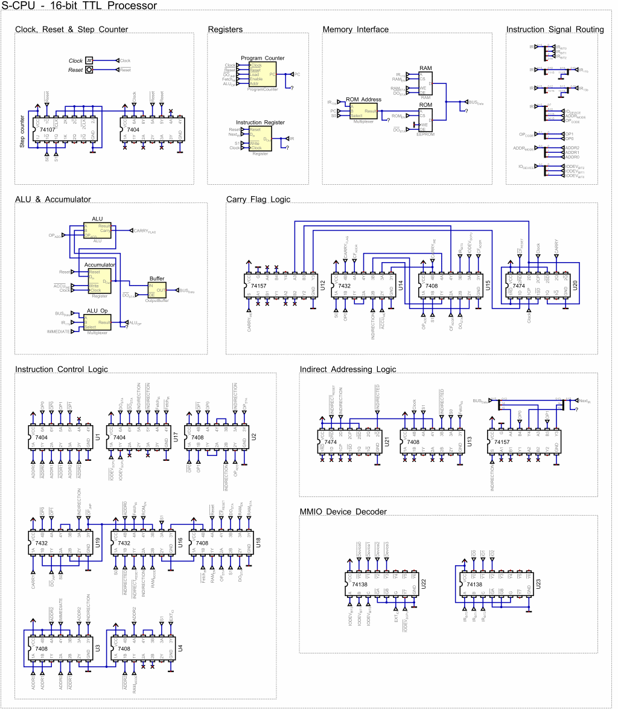
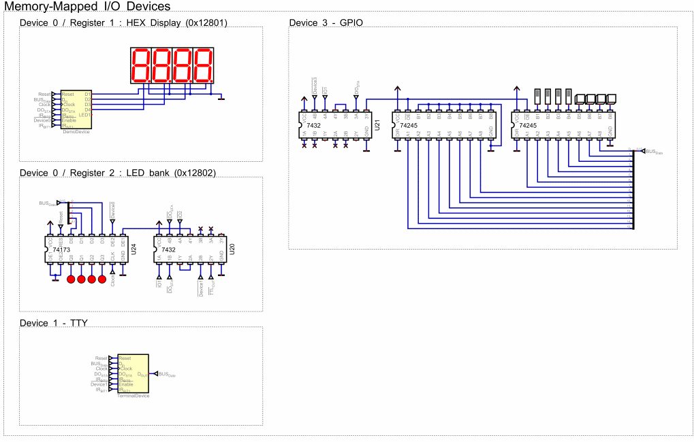
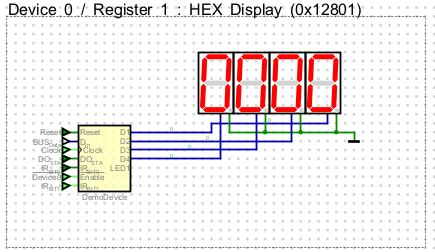
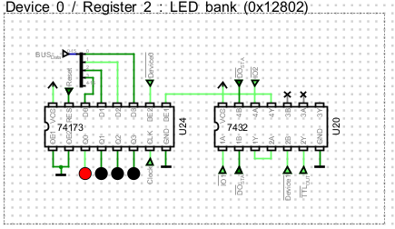
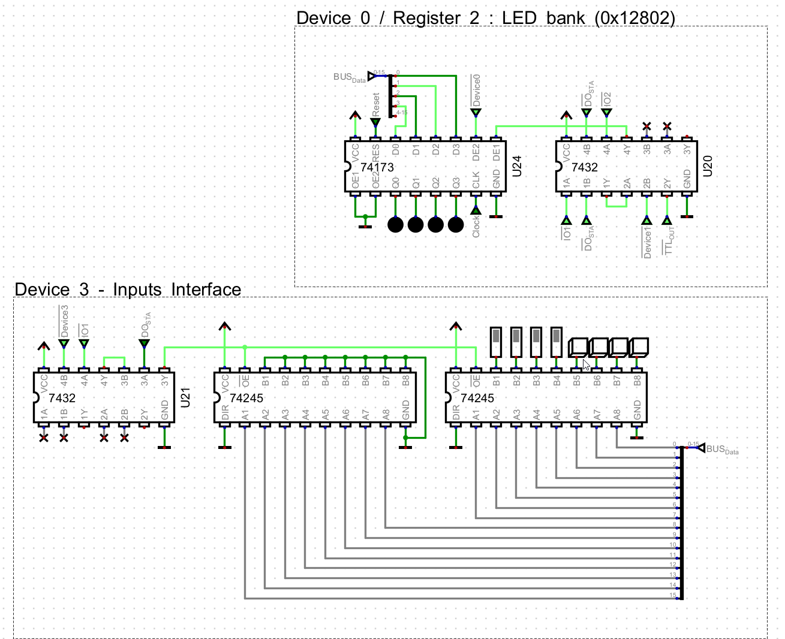
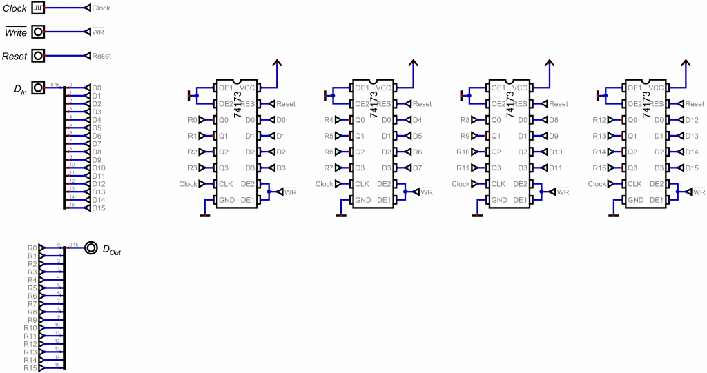
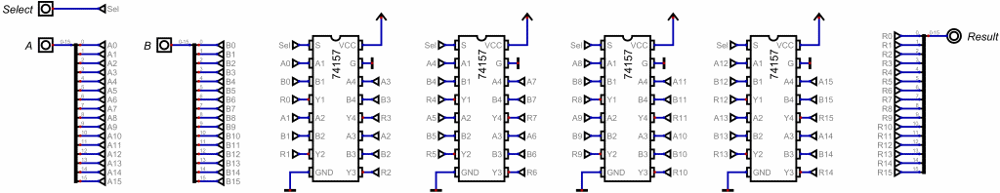
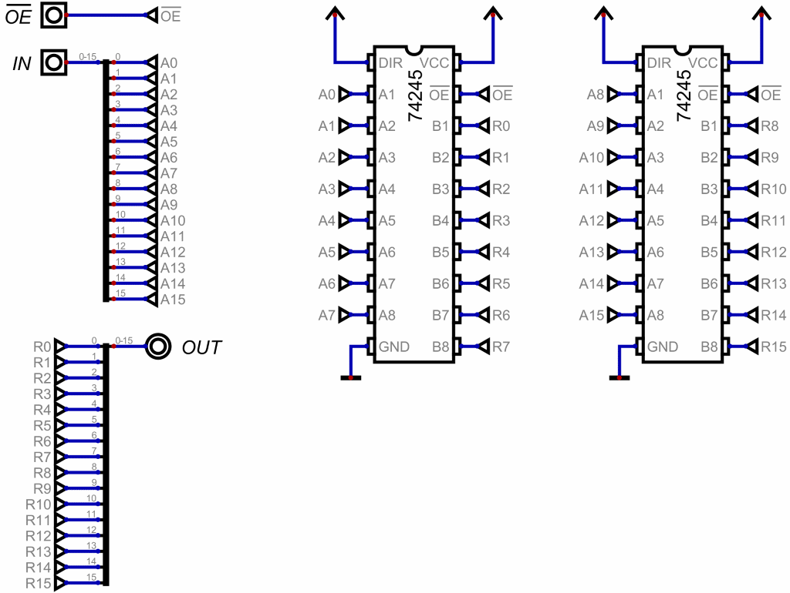
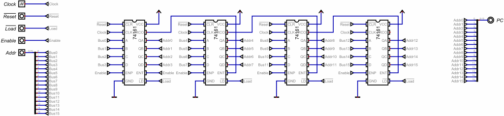
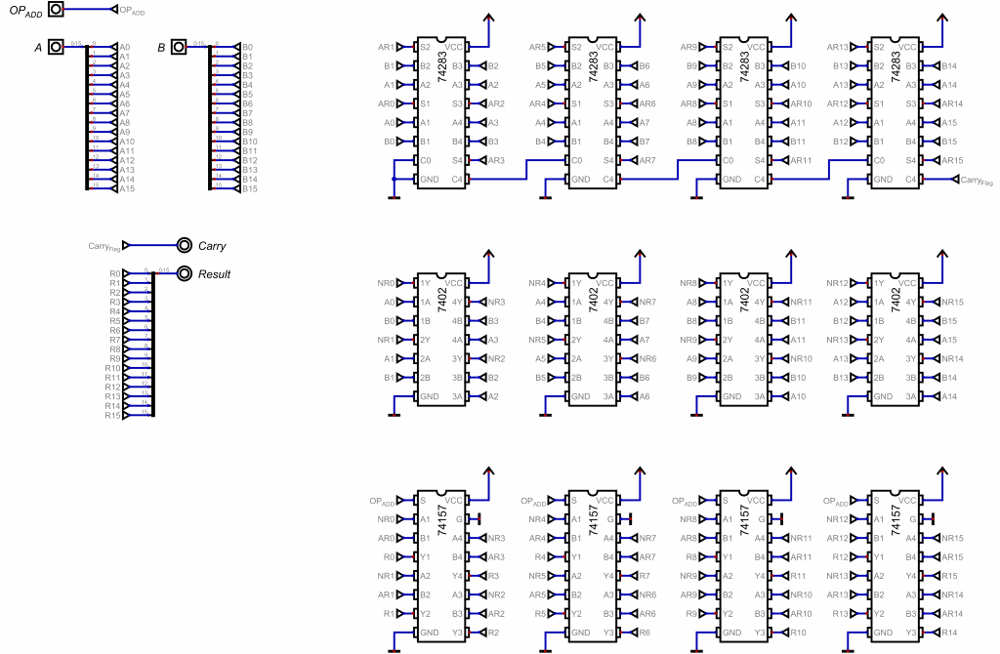

# S-CPU Digital (TTL) Simulation

This folder contains the [**Digital**](https://github.com/hneemann/Digital)
implementation of the S-CPU architecture.

Digital is used here to model the CPU with **74xx-series TTL logic ICs** and
hardware-style interconnects. Compared with [Logisim](../logisim/), Digital is more
focused on chip-level construction, making it possible to reproduce the
S-CPU closely and use the simulation as a practical reference for the physical
[breadboard build](../scpu-ttl/).

Official download: [Digital releases](https://github.com/hneemann/Digital/releases)

The Digital implementation shares the same ISA and ROM format as the other
S-CPU targets and can run the repository's `AutoTest.asm` program.

## Global CPU Design



This top-level circuit presents the S-CPU as a logically organized chip-level design.
It shows the complete datapath and control logic, including the CPU core, ROM, RAM,
MMIO devices, and clocked sequencing.

For full architecture details (ISA, timing model, address map), see the
[S-CPU Architecture guide](../../docs/architecture.md). For ROM image generation
and output formats, see the [assembler guide](../../software/assembler/README.md).

## Implemented MMIO Devices



The Digital simulation includes:

* **Device #0 — Demo Output:** hexadecimal display and LED bank.
* **Device #1 — TTY Console:** interactive terminal using the same register model as the Logisim implementation.
* **Device #3 — Digital Input:** input board built around 74x245 transceivers, currently connected to four switches and four push-buttons.

## Using the Simulation

1. Open `hardware/digital/SCPU.dig` in Digital.
2. The ROM is configured to load `rom.hex` from `hardware/digital` by default.
3. Build or rebuild `hardware/digital/rom.hex` and restart the simulation to reload the updated ROM contents.
4. Start execution by pressing the Play button, or from the menu: `Simulation` > `Start the simulation`.
5. To inspect ROM or RAM contents, right-click the corresponding memory block.

Tip: ROM file binding can be checked in `Edit` > `Specific Circuit Settings` > `Advanced`.

## Assembly and Compilation

The Digital clock is configured for **50 kHz** by default. For timing-based programs, build with `-d FREQ_HZ=50_000`.

### Assembly example (AutoTest)

```sh
# Release
./scpu-assembler -d FREQ_HZ=50_000 -o ./hardware/digital/rom.hex -f Logisim16 ./samples/asm/AutoTest.asm

# Source checkout
dotnet run --project ./software/assembler/SCPU.Assembler.CLI -- -d FREQ_HZ=50_000 -o ./hardware/digital/rom.hex -f Logisim16 ./samples/asm/AutoTest.asm
```

### S-Code example

```sh
# Release
./scode-compiler -d FREQ_HZ=50_000 -f Logisim16 -o ./hardware/digital/rom.hex ./samples/scode/BlinkLED.scode

# Source checkout
dotnet run --project ./software/compiler/SCode.Compiler.CLI -- -d FREQ_HZ=50_000 -f Logisim16 -o ./hardware/digital/rom.hex ./samples/scode/BlinkLED.scode
```

## Demo Walkthrough

### HexCounter



Sample source: [samples/scode/HexCounter.scode](../../samples/scode/HexCounter.scode)

```sh
# Release
./scode-compiler -d FREQ_HZ=50_000 -f Logisim16 -o ./hardware/digital/rom.hex ./samples/scode/HexCounter.scode

# Source checkout
dotnet run --project ./software/compiler/SCode.Compiler.CLI -- -d FREQ_HZ=50_000 -f Logisim16 -o ./hardware/digital/rom.hex ./samples/scode/HexCounter.scode
```

### LEDChaser



Sample source: [samples/scode/LEDChaser.scode](../../samples/scode/LEDChaser.scode)

```sh
# Release
./scode-compiler -d FREQ_HZ=50_000 -f Logisim16 -o ./hardware/digital/rom.hex ./samples/scode/LEDChaser.scode

# Source checkout
dotnet run --project ./software/compiler/SCode.Compiler.CLI -- -d FREQ_HZ=50_000 -f Logisim16 -o ./hardware/digital/rom.hex ./samples/scode/LEDChaser.scode
```

### Inputs

This demo focuses on the device-3 input board. Buttons 0-3 light the matching
LEDs. Input bit 7, connected to the fourth switch, controls inversion of the
displayed button nibble. The same sample works on Digital and the physical
S-CPU TTL when the device-3 input board is present.



Sample sources:

* [samples/asm/Inputs.asm](../../samples/asm/Inputs.asm)
* [samples/scode/Inputs.scode](../../samples/scode/Inputs.scode)

```sh
# Assembly version
./scpu-assembler -d FREQ_HZ=50_000 -o ./hardware/digital/rom.hex -f Logisim16 ./samples/asm/Inputs.asm

# S-Code version
./scode-compiler -d FREQ_HZ=50_000 -f Logisim16 -o ./hardware/digital/rom.hex ./samples/scode/Inputs.scode
```

After generating `rom.hex`, restart the simulation and press Play.

## Hardware Implementation Details

### Subcircuits

The yellow blocks in the main schematic represent reusable chip-level subcircuits.

#### 16-bit Register (74x173 based)



Built from 74x173 register chips. Used for key CPU registers such as the
accumulator and instruction register (IR).

#### 16-bit Multiplexer (74x157 based)



Built from cascaded 74x157 multiplexers to select datapath sources over
16-bit words.

#### Output Buffer (74x245 based)



Built with 74x245 bus transceivers to control accumulator output onto the data
bus, because 74x173 outputs are not tri-state.

#### Program Counter (4 x 74x161)



A 16-bit PC implemented with four 74x161 synchronous 4-bit counters.

#### ALU (74x283 + 74x02 + 74x157)



The ALU is assembled from:

* 4 x 74x283 adders for 16-bit addition;
* 4 x 74x02 NOR chips to compute 16-bit NOR results;
* 4 x 74x157 multiplexers to select ADD or NOR results from the opcode path.

### Components Used

The following count covers the CPU core shown in the main Digital schematic and excludes simulated ROM, RAM, and optional MMIO devices.

- 3x [74x04](../../docs/datasheets/SN54LS04.PDF) - Hex Inverter
- 4x [74x02](../../docs/datasheets/SN54LS02.PDF) - Quad 2-input NOR Gates
- 6x [74x08](../../docs/datasheets/SN54LS08.PDF) - Quad 2-input AND Gates
- 3x [74x32](../../docs/datasheets/SN54LS32.PDF) - Quad 2-input OR Gates
- 2x [74x74](../../docs/datasheets/SN54LS74A.PDF) - Dual D-type Flip-Flops
- 1x [74x107](../../docs/datasheets/SN54LS107A.PDF) - Dual J-K Flip-Flops
- 1x [74x138](../../docs/datasheets/SN54LS138.PDF) - 1-of-8 decoder (Demultiplexer)
- 13x [74x157](../../docs/datasheets/SN54LS157.PDF) - Quad 2-to-1 Multiplexers
- 4x [74x161](../../docs/datasheets/SN54LS161A.PDF) - Synchronous 4-bit Counters
- 8x [74x173](../../docs/datasheets/SN54LS173A.PDF) - 4-bit D-type Registers
- 4x [74x283](../../docs/datasheets/SN54LS283.PDF) - 4-bit Adders
- 2x [74x245](../../docs/datasheets/SN54LS245.PDF) - Octal Bus Transceivers

The design also includes simulated ROM and RAM to run programs.

### Breadboard Layout Version

A secondary Digital simulation reproduces the physical organization of the S-CPU TTL breadboard build.

Unlike the logically grouped main schematic, this version arranges components
by breadboard and positions the chips to match the physical implementation.
It is intended to make signal tracing, wiring, assembly, and comparison with
the real computer easier.

This layout serves as the direct placement and wiring reference for the
[physical S-CPU TTL](../scpu-ttl/).


