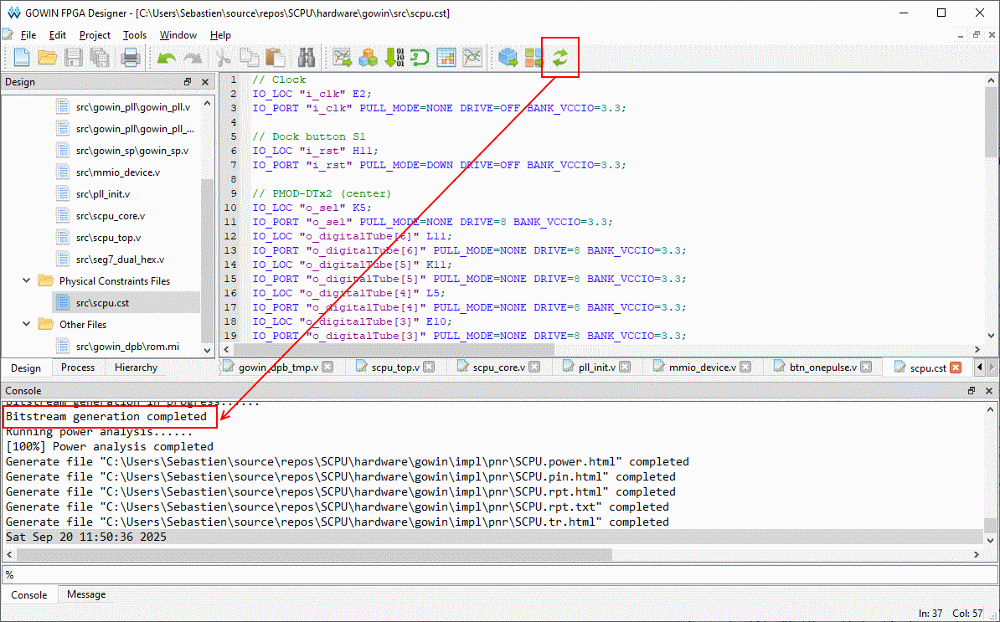
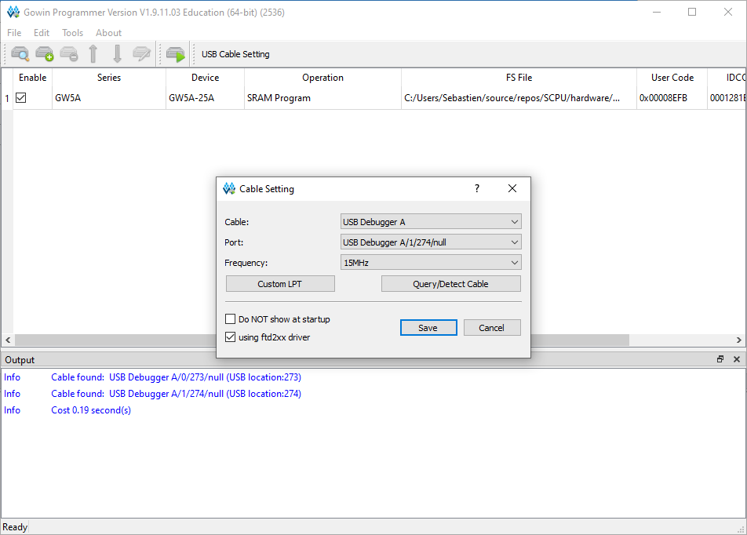
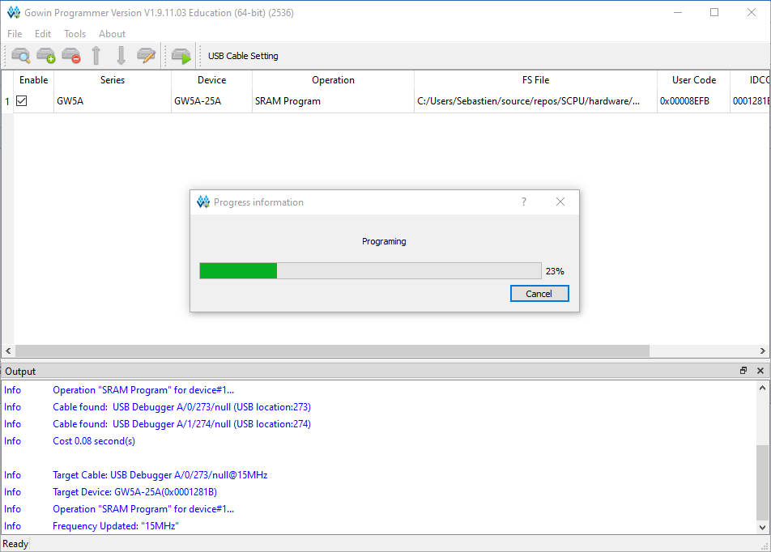
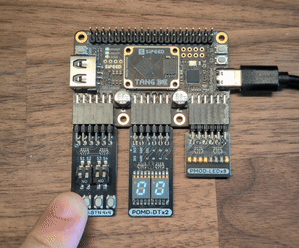
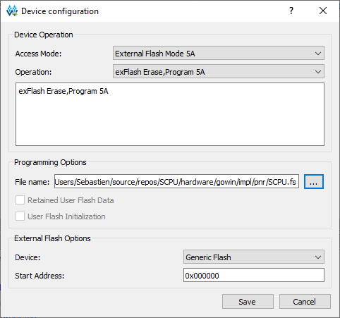
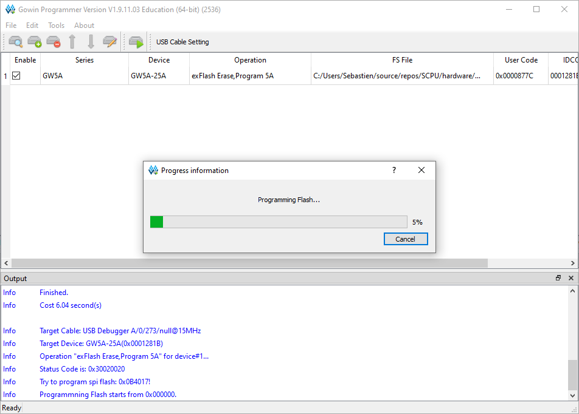
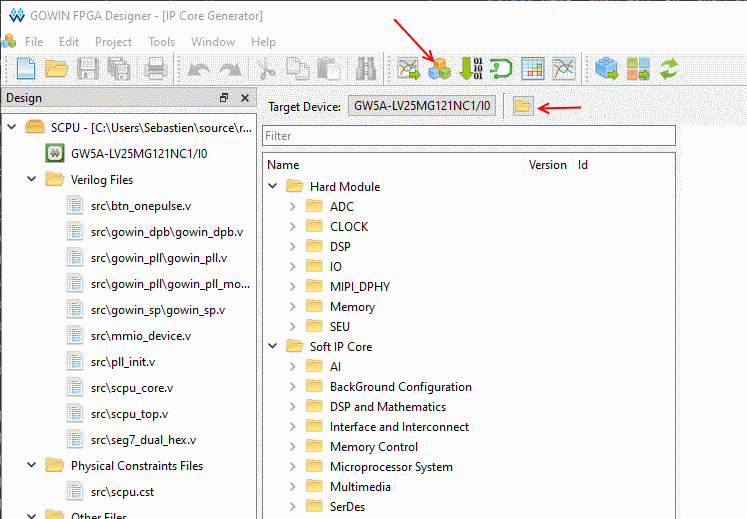
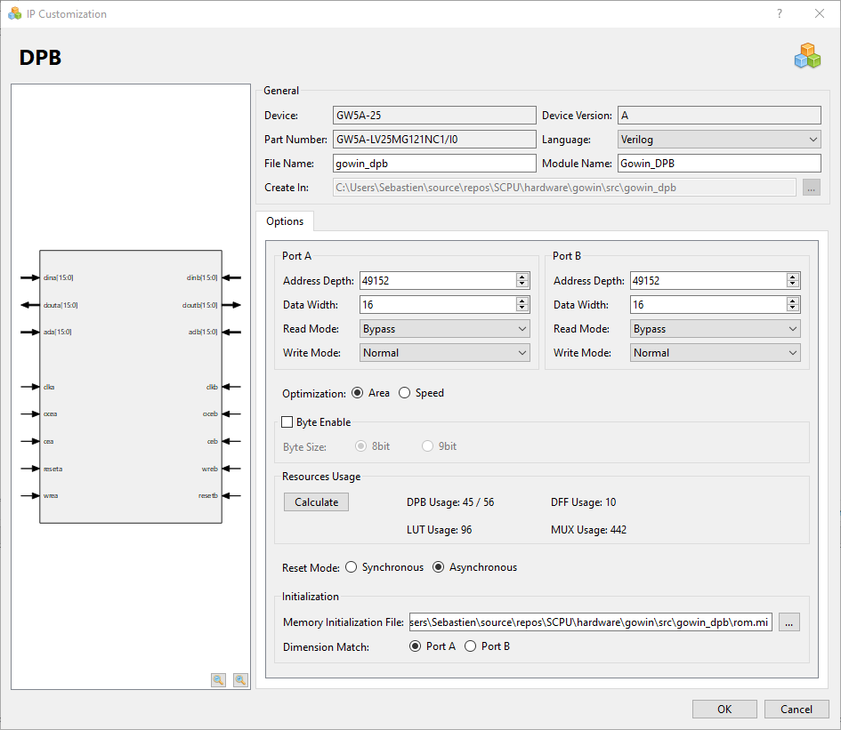
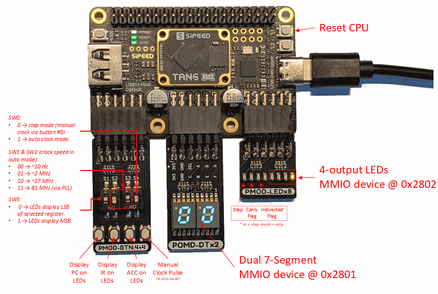
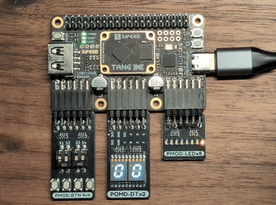

# S-CPU on FPGA

This folder contains the S-CPU FPGA implementation for the
[Tang Primer 25K](https://wiki.sipeed.com/hardware/en/tang/tang-primer-25k/primer-25k.html), based on the
Gowin **GW5AST-LV25** FPGA.

The core is **derived from** the shared [Verilog implementation](../verilog/)
and adapted for FPGA constraints: synchronous block RAM IPs, board clocking,
clock-enable based execution control, and physical board I/O.


For architecture details, see the [S-CPU Architecture guide](../../docs/architecture.md).

## Repository Structure

```
impl/                         # Implementation output generated by Gowin IDE
src/
├─ btn_onepulse.v             # Button synchronizer/debounce + one-pulse
├─ gowin_dpb/
│  ├─ gowin_dpb.v             # Generated Gowin_DPB ROM IP wrapper
│  ├─ gowin_dpb_tmp.v         # Generated instantiation template
│  └─ rom.mi                  # ROM initialization file loaded by Gowin_DPB
├─ gowin_pll/
│  ├─ gowin_pll.v             # Generated PLL wrapper using Gowin_PLL_MOD + PLL_INIT
│  ├─ gowin_pll_mod.v         # Generated PLL primitive configuration
│  ├─ gowin_pll_mod_tmp.v     # Generated instantiation template
│  └─ gowin_pll_tmp.v         # Generated instantiation template
├─ gowin_sp/
│  ├─ gowin_sp.v              # Generated Gowin_SP data RAM IP wrapper
│  └─ gowin_sp_tmp.v          # Generated instantiation template
├─ mmio_device.v              # MMIO device 0 (hex display + LED bank)
├─ pll_init.v                 # Generated PLL initialization helper (used by gowin_pll.v)
├─ scpu_core.v                # S-CPU core adapted to synchronous FPGA memory IPs
├─ scpu_top.v                 # Top-level integration (clocking, controls, debug, MMIO)
├─ scpu.cst                   # Board pin constraints
└─ seg7_dual_hex.v            # Dual 7-segment display driver

SCPU.gprj                     # Gowin IDE project file
```

## Requirements

* Tang Primer 25K board (GW5AST-LV25) with the PMOD modules used by this design:
  PMOD-BTN, PMOD-LED, and PMOD Digital Tube.
* [Gowin IDE Education Edition](https://www.gowinsemi.com/en/support/download_eda/), tested with version 1.9.x.
* Gowin Programmer (installed with Gowin IDE).
* S-CPU assembler or S-Code compiler if you want to regenerate `rom.mi`.

## Building and Programming

1. Open [SCPU.gprj](./SCPU.gprj) in Gowin IDE.
2. Build the project.



3. Open Gowin Programmer.
4. Select your cable in **Cable Setting**.



5. Program the bitstream.



By default, programming uses **SRAM Program**. This is volatile and is lost when
power is removed.



To keep the bitstream across power cycles:

1. Open **Device Configuration**.
2. Set **Access Mode** to **External Flash Mode 5A**.



3. Program external flash.



External flash programming is persistent; the FPGA reloads from flash at boot.

## Updating the ROM

Run these commands from the **repository root**.

```sh
# Release
./scpu-assembler -o ./hardware/gowin/src/gowin_dpb/rom.mi -f Gowin ./samples/asm/AutoTest.asm

# Source checkout
dotnet run --project ./software/assembler/SCPU.Assembler.CLI -- -o ./hardware/gowin/src/gowin_dpb/rom.mi -f Gowin ./samples/asm/AutoTest.asm
```

For delay-based programs, set `FREQ_HZ` to the selected CPU clock.
Example at 81 MHz:

```sh
# Release
./scpu-assembler -o ./hardware/gowin/src/gowin_dpb/rom.mi -f Gowin -d FREQ_HZ=81_000_000 ./samples/asm/BlinkLED.asm

# Source checkout
dotnet run --project ./software/assembler/SCPU.Assembler.CLI -- -o ./hardware/gowin/src/gowin_dpb/rom.mi -f Gowin -d FREQ_HZ=81_000_000 ./samples/asm/BlinkLED.asm
```

Updating `rom.mi` alone does **not** change an already-built bitstream.

After updating `rom.mi`, regenerate the Gowin_DPB IP core, rebuild the project,
and reprogram the FPGA.

IP regeneration flow in Gowin IDE:

1. Open **IP Core Generator** and load `src/gowin_dpb/gowin_dpb.ipc`.



2. Regenerate **Gowin_DPB**.



## Board Controls and I/O



Button and switch names below follow the PMOD-BTN orientation shown in the image.
`BTN0`/`SW0` are rightmost. `BTN3`/`SW3` are leftmost.

Manual step mode and automatic clock mode:

* `SW0` selects execution mode (`i_switch[0] = 1` step/manual, `i_switch[0] = 0` automatic).
* `BTN0` generates one CPU pulse in manual step mode.

Register display selection:

* `BTN1` selects `ACC` on debug LEDs.
* `BTN2` selects `IR` on debug LEDs.
* `BTN3` selects `PC` on debug LEDs.

MSB/LSB selection:

* `i_switch[3] = 0`: show selected register MSB.
* `i_switch[3] = 1`: show selected register LSB.

Clock selection in automatic mode:

* `SW1` and `SW2` choose the clock mode (see the Clock Modes section).

Program-controlled LEDs and debug LEDs (PMOD-LED):

* `LED0` to `LED3` (right side) are program-controlled outputs from MMIO device 0.
* `LED4` to `LED7` (left side) are debug indicators in step/debug view:
  * `LED7`: `STEP`
  * `LED6`: `CARRY`
  * `LED5`: `INDIRECTED`
  * `LED4`: reserved

MMIO addresses for device 0:

* Hex display register: internal MMIO address `0x2801`, assembler virtual
  address `0x12801`.
* LED bank register: internal MMIO address `0x2802`, assembler virtual address
  `0x12802`.

These addresses match the shared S-CPU MMIO model used by the other
implementations.

## Clock Modes

The design uses the 27 MHz board clock as PLL input, then runs the CPU on a
PLL-generated 81 MHz core clock.

`i_switch[2:1]` is sampled at reset and inverted in hardware to produce
`speed_mode = ~i_switch[2:1]`.

In automatic mode, the four speed options are implemented by clock-enable logic
in [src/scpu_top.v](src/scpu_top.v):

* `11`: full-rate execution at 81 MHz,
* `10`: one enable every 3 cycles (~27 MHz effective),
* `01`: NCO ratio 2/81 (~2 MHz effective),
* `00`: one enable every 8,100,000 cycles (~10 Hz effective).

So, `10`, `01`, and `00` are all derived from the same 81 MHz core domain
(not from separate external clocks).

| speed_mode (`~i_switch[2:1]`) | Effective CPU rate | Implementation detail |
| ----------------------------- | ------------------ | --------------------- |
| `00`                          | ~10 Hz             | Debug-friendly slow stepping (CE tick every 8,100,000 cycles at 81 MHz) |
| `01`                          | ~2 MHz             | TTL-oriented effective rate (NCO ratio 2/81), aligned with [SCPU TTL](../scpu-ttl) |
| `10`                          | ~27 MHz            | Effective rate equivalent to the board crystal frequency, via divide-by-3 CE from 81 MHz |
| `11`                          | 81 MHz             | Full-rate PLL mode |

81 MHz is the highest default mode configured in the shipped project.

## Demo — LED Chaser



Sample source:
[samples/scode/LEDChaser.scode](../../samples/scode/LEDChaser.scode)

```c
#include "core/Delay"
#include "io/DigitalWrite"

#const int LED_BANK = 0x002;
#const int DELAY_MS = 100;
#const int LED_PATTERN_COUNT = 6;

const int ledPattern[] = { 8, 4, 2, 1, 2, 4 };

int ledIndex = 0;
while (true) {
    DigitalWrite(LED_BANK, ledPattern[ledIndex]);
    ledIndex = ledIndex + 1;
    if (ledIndex >= LED_PATTERN_COUNT) {
        ledIndex = 0;
    }
    delay(DELAY_MS);
}
```

Compile commands (run from repository root):

```sh
# Release
./scode-compiler -o ./hardware/gowin/src/gowin_dpb/rom.mi -f Gowin -d FREQ_HZ=81_000_000 ./samples/scode/LEDChaser.scode

# Source checkout
dotnet run --project ./software/compiler/SCode.Compiler.CLI -- -o ./hardware/gowin/src/gowin_dpb/rom.mi -f Gowin -d FREQ_HZ=81_000_000 ./samples/scode/LEDChaser.scode
```

After compilation, regenerate `Gowin_DPB`, rebuild, and reprogram the FPGA.

## Design Notes

* This FPGA port is derived from [hardware/verilog](../verilog/) and adapted
  to synchronous memory IP interfaces and board-level controls.
* Program ROM is implemented with `Gowin_DPB` and data RAM with `Gowin_SP`.
* The core executes with `S0`/`S1` phases and a clock-enable input (`ce`) from
  the top-level clock mode logic.
* The PMOD display path is MMIO-based through device 0 (`mmio_device.v`).

## IP Cores Used

* `Gowin_DPB` (generated IP): synchronous dual-port block RAM used as ROM.
* `Gowin_SP` (generated IP): synchronous single-port block RAM used as data RAM.
* `Gowin_PLL_MOD` (generated IP): PLL primitive configuration.
* `pll_init.v` (generated helper): PLL initialization/control helper used by
  [src/gowin_pll/gowin_pll.v](src/gowin_pll/gowin_pll.v).

Note: the user-visible 10 Hz / 2 MHz / 27 MHz / 81 MHz selection logic is in
[src/scpu_top.v](src/scpu_top.v), not in `pll_init.v`.

## Troubleshooting

* Inputs and LEDs are wired with active-low board conventions in this design;
  the top-level logic inverts where needed.
* `i_rst` and `SW0` are synchronized to the core clock with `sync_2ff`.
* `BTN0` uses `btn_onepulse` (2-flop synchronization + debounce + one-pulse).
* `BTN1`/`BTN2`/`BTN3` and `SW3` are used for debug display selection.
* If program behavior does not change after updating source code, verify that:
  * `rom.mi` was regenerated,
  * `Gowin_DPB` was regenerated,
  * the project was rebuilt,
  * and the FPGA was reprogrammed.
* If board behavior looks wrong, re-check [src/scpu.cst](src/scpu.cst) pin
  mapping and PMOD orientation.
