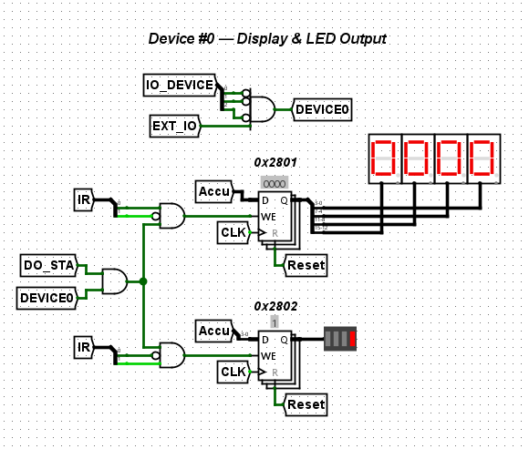
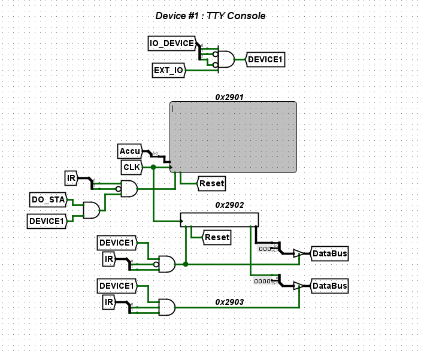
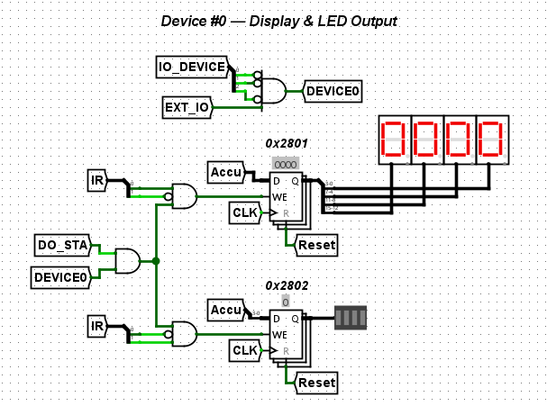

# S-CPU Logisim Simulation

This folder contains the **Logisim-evolution** implementation of the S-CPU.

Logisim was the first environment in which the processor architecture took
shape. The core logic, buses, memory model, MMIO devices, and initial programs
were validated here before the design was carried into the other hardware and
software implementations.

Logisim-evolution makes digital systems visible and interactive. Its level of
abstraction keeps the work centered on datapath and control-logic design rather
than electronics implementation details. Gates, multiplexers, registers,
memories, and buses are easy to inspect, including while the CPU is running.
It is an ideal environment to explore, design, and validate a minimalist CPU
architecture such as S-CPU.

## Logisim-evolution

Official download: [Logisim-evolution releases](https://github.com/logisim-evolution/logisim-evolution/releases)

This S-CPU simulation targets Logisim-evolution, not the original Logisim project. The file paths, menu names, and workflow below match Logisim-evolution.

## Why Logisim Mattered for S-CPU

Logisim was the first proving ground for S-CPU because it made the complete
machine visible at circuit level.

It provided a practical way to validate the instruction cycle, control logic,
memory access, and MMIO behavior before moving toward the TTL, Verilog, FPGA,
assembler, compiler, and simulator implementations.

In short, Logisim is where S-CPU became a working architecture rather than
just an idea.

## S-CPU Overview


This overview shows the complete processor at a glance.

For the detailed architecture, instruction set, memory model, and timing rules,
see the [S-CPU Architecture guide](../../docs/architecture.md). For the output
formats and build commands used to generate ROM images for Logisim, see the
[assembler guide](../../software/assembler/README.md).

The diagram is meant to orient you quickly: CPU core, registers, ROM/RAM, bus, and MMIO devices.

## What the Logisim Design Contains

At a practical level, the Logisim version exposes the same CPU shape you see in the larger S-CPU architecture docs, but in a circuit you can inspect and run directly.

The main blocks are easy to spot in the schematic:

* monitoring for the PC, IR, accumulator, and internal bus;
* a program counter and a step counter;
* registers for the IR, accumulator, and the indirection and carry flags;
* a 64K × 16-bit ROM and a 2K × 16-bit addressable RAM space;
* control logic built from an adder, NOR-based ALU behavior, multiplexers, and basic gates such as AND, OR, and NOT.

This is exactly why the Logisim version is such a strong starting point: it
keeps attention on logical architecture and datapath behavior, which is the
right level when designing and validating a minimalist CPU.

## Implemented Devices

The Logisim version exposes two memory-mapped devices.

### Device #0 — Demo Output



Address range: `0x12800 - 0x128FF`

This device is the quickest way to confirm that the CPU-to-output path is alive.

* Address `0x12801`: HEX display for a 16-bit value.
* Address `0x12802`: 4-bit LED bar.

### Device #1 — TTY Console



Address range: `0x12900 - 0x129FF`

This device provides a minimal interactive terminal for manual testing and debug loops.

* Address `0x12901`: 7-bit ASCII output register, used to write a character to the terminal.
* Address `0x12902`: 7-bit ASCII input register, which reads and consumes the next buffered character.
* Address `0x12903`: 1-bit input-buffer-ready flag.

## Using the Simulation

1. Open `hardware/logisim/SCPU.circ` in Logisim-evolution.
2. Right-click the ROM, then choose `Load image`.
3. Load a ROM image generated in `Logisim16` format.
4. In the `Simulate` menu, enable `AutoTick`, or press `Ctrl+F9` to start and stop the simulation.
5. Press `Ctrl+R` to reset the S-CPU.
6. Right-click the RAM and choose `Edit Contents` to inspect memory during execution.

## Assembly and Compilation

Programs can be emitted directly in `Logisim16` format:

```sh
# Release
./scpu-assembler -o ./hardware/logisim/rom.hex -f Logisim16 ./samples/asm/AutoTest.asm

# Source checkout
dotnet run --project ./software/assembler/SCPU.Assembler.CLI -- -o ./hardware/logisim/rom.hex -f Logisim16 ./samples/asm/AutoTest.asm
```

For demos that use `Delay.asm`, define the target frequency explicitly through
`FREQ_HZ`.

Logisim may not sustain the configured AutoTick rate once the simulation
becomes CPU-bound. Depending on the host machine and circuit load, increasing
the setting beyond roughly 32–64 kHz may no longer improve effective execution
speed. Use `FREQ_HZ=16_000` for the included timing-based demos.

## Demo Walkthrough

The two screenshots below are the easiest way to see the simulation working end to end.

### HexCounter



Sample source: [samples/scode/HexCounter.scode](../../samples/scode/HexCounter.scode)

```sh
# Release
./scode-compiler -d FREQ_HZ=16_000 -f Logisim16 -o ./hardware/logisim/rom.hex ./samples/scode/HexCounter.scode

# Source checkout
dotnet run --project ./software/compiler/SCode.Compiler.CLI -- -d FREQ_HZ=16_000 -f Logisim16 -o ./hardware/logisim/rom.hex ./samples/scode/HexCounter.scode
```

### LEDChaser


Sample source: [samples/scode/LEDChaser.scode](../../samples/scode/LEDChaser.scode)

```sh
# Release
./scode-compiler -d FREQ_HZ=16_000 -f Logisim16 -o ./hardware/logisim/rom.hex ./samples/scode/LEDChaser.scode

# Source checkout
dotnet run --project ./software/compiler/SCode.Compiler.CLI -- -d FREQ_HZ=16_000 -f Logisim16 -o ./hardware/logisim/rom.hex ./samples/scode/LEDChaser.scode
```

Load the generated `rom.hex` file into the Logisim ROM, enable AutoTick, and reset the CPU to restart the demo.

## Practical Notes

* If the simulation feels slow or unresponsive, reduce the AutoTick frequency first.
* If you want to inspect behavior quickly, start with a simple demo such as `HexCounter` or `LEDChaser`.
* If you edit RAM manually, reset the CPU after a full ROM load so you begin from a clean state.
