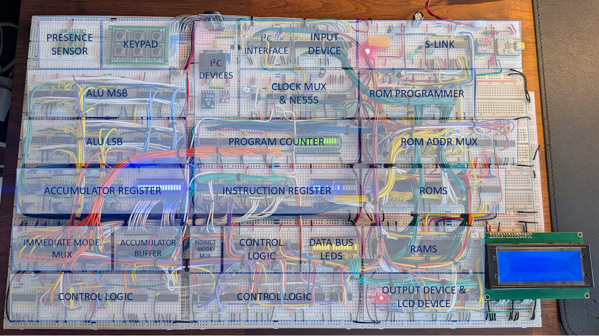
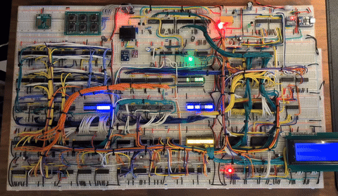

# S-CPU TTL

This folder documents the physical **S-CPU TTL** implementation: a complete
16-bit processor built from **74xx-series logic ICs** on breadboards.

The physical machine implements the same S-CPU ISA and architectural model as the simulation, Verilog, and FPGA targets in this repository.

The current physical build consists of:

* approximately **70 logic ICs**,
* **18 breadboards**,
* approximately **1,000 jumper wires**,
* physical ROM, RAM, registers, counters, ALU, control logic, and MMIO interfaces.


The [Digital implementation](../digital/) is used as the chip-level
simulation and wiring/layout reference for this physical build.

## Overview

| Item | Description |
| --- | --- |
| **Architecture** | 16-bit accumulator-based S-CPU |
| **Technology** | 74xx-series logic ICs with external ROM and RAM |
| **Physical build** | 18 breadboards, approximately 70 ICs and 1,000 jumper wires |
| **Default clock** | 2 MHz |
| **Control interface** | S-Link ESP32 companion for system control and ROM programming |
| **Programming** | Binary ROM images uploaded and flashed through S-Link |

## Physical Architecture

At the architectural level, the physical machine implements the same major S-CPU
blocks as the other targets:

* Program Counter (`PC`),
* Instruction Register (`IR`),
* Accumulator (`ACC`),
* ALU,
* carry and indirection state,
* control logic,
* ROM and RAM,
* shared data/control buses,
* MMIO decoding.

The implementation is physically realized with 74xx-series logic ICs plus
external memory chips and peripheral wiring.

For ISA semantics, instruction format, addressing modes, and the S0/S1 timing
model, see the [S-CPU Architecture guide](../../docs/architecture.md).

## Breadboard Organization



The 18 breadboards are organized by functional groups (CPU core logic, memory,
I/O/peripheral interfaces, and support circuitry).

The [Digital layout view](../digital/README.md#breadboard-layout-version) mirrors this physical arrangement and serves as a direct placement and wiring reference for the breadboard implementation.

## Clock, Reset, and Power

[S-Link](../../firmware/slink/) is the browser-based control and programming
companion for the physical S-CPU TTL.
It does not execute S-CPU instructions or participate in the CPU datapath.
Program execution remains entirely within the TTL processor.

For system control, S-Link manages:

* global power switching through a **2A relay**,
* master reset,
* ESP32-generated PWM clock signals,
* manual clock pulses,
* the clock-source multiplexer selecting either the **ESP32 PWM** signal or the standalone **NE555** oscillator.

Clock characteristics:

* S-Link default clock setting: **2,000,000 Hz** (`DEFAULT_FREQUENCY`),
* S-Link software maximum setting: **5,000,000 Hz** (`MAX_FREQUENCY`),
* PWM control path implemented in `firmware/slink/src/SLink.cpp`.

Operating frequencies on this build:

* **2 MHz** is the default and consistently reliable operating point.
* The `AutoTest` program has completed successfully at approximately **4.5 MHz**.
* More I/O-intensive programs, particularly those using I²C, become unreliable above approximately **4 MHz**.
* S-Link accepts settings up to **5 MHz**; practical operating frequency is set	by the workload and hardware conditions.

Reset behavior:

* S-Link generates the master reset signal (`MASTER_RESET_PULSE_MS = 50 ms`).
* This reset line is connected to the **ACC**, **PC**, **IR**, and **Step Counter** registers.
* A reset can be triggered manually from the S-Link Web interface or through the HTTP API (`/control/reset`).
* S-Link also triggers reset automatically after power-on (relay ON) and when entering programmer mode.

Power:

* all S-CPU TTL breadboards are powered through the **2A relay** controlled by S-Link,
* the S-Link breadboard remains powered continuously.

Measured current draw at 5 V on the current physical build:

* **S-Link only, S-CPU powered off:** approximately **400 mA**.
* **S-CPU powered, clock stopped:** approximately **600 mA**.
* **Complete system running at 2 MHz:** approximately **750 mA** with `HardwareShowcase`, including LCD2004 refresh and I²C sensor polling.

Power filtering strategy used on the physical build:

* **100 nF ceramic** on each TTL chip for local high-frequency decoupling,
* **100 µF** at the end of each power column for line-end filtering and local voltage-drop mitigation,
* **220 µF + 100 nF** at each column input for column-level rail stabilization,
* one **1,000 µF** bulk capacitor after the relay for main supply filtering and inrush/current-spike damping at power-up.

## ROM Programming

Through its browser interface, S-Link also supports:

* ROM image upload,
* ROM erase and flashing operations,
* live programming status and progress feedback.

Web entry point: [http://slink.local](http://slink.local)

Typical workflow:

1. Assemble or compile a program.
2. Generate a binary ROM image.
3. Upload it through S-Link (`-u http://slink.local/upload`).
4. Flash the uploaded image to the physical ROM from the S-Link interface.
5. Reset and run the processor.

Assembly upload example:

```sh
# Release
./scpu-assembler -d FREQ_HZ=2_000_000 -f Binary -u http://slink.local/upload ./samples/asm/AutoTest.asm

# Source checkout
dotnet run --project ./software/assembler/SCPU.Assembler.CLI -- -d FREQ_HZ=2_000_000 -f Binary -u http://slink.local/upload ./samples/asm/AutoTest.asm
```

S-Code upload example:

```sh
# Release
./scode-compiler -d FREQ_HZ=2_000_000 -f Binary -u http://slink.local/upload ./samples/scode/BlinkLED.scode

# Source checkout
dotnet run --project ./software/compiler/SCode.Compiler.CLI -- -d FREQ_HZ=2_000_000 -f Binary -u http://slink.local/upload ./samples/scode/BlinkLED.scode
```

## Implemented MMIO Devices

Device map model is shared with the S-CPU ecosystem:

* internal MMIO base: `0x2800`,
* assembler virtual MMIO base: `0x12800`,
* capacity: 8 devices × 256 registers, with **Device #7 reserved by S-CPU core logic**.

MMIO devices wired on this S-CPU TTL implementation:

| Device | Interface       |  Internal range |     Virtual range | Notes                                                          |
| ------ | --------------- | --------------: | ----------------: | -------------------------------------------------------------- |
| **#0** | **Demo Output** | `0x2800–0x28FF` | `0x12800–0x128FF` | 4-bit LED bank at `+0x02` (`0x12802`), same mapping as Logisim, Digital, Verilog, Gowin, and simulator targets; hexadecimal display at `+0x01`. |
| **#2** | **LCD2004**     | `0x2A00–0x2AFF` | `0x12A00–0x12AFF` | HD44780 command register at `+0x01`, data register at `+0x02`. |
| **#3** | **GPIO / I²C**  | `0x2B00–0x2BFF` | `0x12B00–0x12BFF` | External inputs, sensors, and open-collector I²C bus.          |


Permanent interfaces and external peripherals:

* **Device #0** is the built-in visible MMIO output interface.
* **Device #2** is the permanent LCD interface; the LCD2004 module itself is an externally connected display.
* **Device #3** is the permanent GPIO interface used for external I/O and the open-collector I²C bus.

Device #3 wiring on this physical build:

* I²C bus peripherals: **BME280** (temperature/humidity), **TSL2561** (light sensor), **DS3231** (RTC), and **SSD1306 OLED** display.
* GPIO input peripherals: one presence sensor and one external board with 6 push buttons.

## Running a Program

Minimal beginner flow using `AutoTest`:

1. Run from repository root:

```sh
# Release
./scpu-assembler -d FREQ_HZ=2_000_000 -f Binary -u http://slink.local/upload ./samples/asm/AutoTest.asm

# Source checkout
dotnet run --project ./software/assembler/SCPU.Assembler.CLI -- -d FREQ_HZ=2_000_000 -f Binary -u http://slink.local/upload ./samples/asm/AutoTest.asm
```

2. Open [http://slink.local](http://slink.local).
3. Flash the uploaded ROM image.
4. Start the clock.
5. Observe the Device #0 output. A successful run ends with the status LED set to `1`.

## Demo — LED Chaser



Sample source: [samples/scode/LEDChaser.scode](../../samples/scode/LEDChaser.scode)

Compile and upload (run from repository root):

```sh
# Release
./scode-compiler -d FREQ_HZ=2_000_000 -f Binary -u http://slink.local/upload ./samples/scode/LEDChaser.scode

# Source checkout
dotnet run --project ./software/compiler/SCode.Compiler.CLI -- -d FREQ_HZ=2_000_000 -f Binary -u http://slink.local/upload ./samples/scode/LEDChaser.scode
```

After flashing and running, the LED bank should show the K2000-style moving pattern.

## Hardware Specifications

| Item | Value |
| ---- | ------------------------------- |
| Word size | 16-bit |
| Logic technology | 74xx-series logic ICs |
| Breadboards | 18 |
| Approximate logic IC count | ~70 |
| Approximate jumper count | ~1,000 |
| ROM | 2 × SST39SF010A, with separate high-byte and low-byte devices forming a 16-bit word |
| RAM | 2 × UT6264C, with separate high-byte and low-byte devices forming a 16-bit word |
| Default operating frequency | 2 MHz (`FREQ_HZ=2_000_000`) |
| AutoTest observed successful up to | ~4.5 MHz |
| I/O-intensive programs observed reliable up to | ~4 MHz |
| S-Link software maximum clock setting | 5 MHz |
| Power consumption — S-Link only, S-CPU off | ~400 mA at 5 V |
| Power consumption — S-CPU powered, clock stopped | ~600 mA at 5 V |
| Power consumption — operating at 2 MHz | ~750 mA at 5 V |
| Power domains | TTL side at 5 V and S-Link ESP32 side at 3.3 V (level shifted interfaces) |
| MMIO capacity | 8 devices × 256 registers (Device #7 reserved by S-CPU core logic) |

For component references, see the [datasheets](../../docs/datasheets/).

## Practical Notes and Limitations

* Breadboard wiring density is high, so signal integrity and power stability directly impact reliability.
* Timing-sensitive programs should run at a clock frequency consistent with the `FREQ_HZ` value used at build time.
* Source changes require a full deploy cycle: rebuild binary, upload/flash via S-Link, then reset before execution.
* Some TTL demos depend on external peripherals (I2C sensors, OLED, input modules) that are not present in software simulators.
