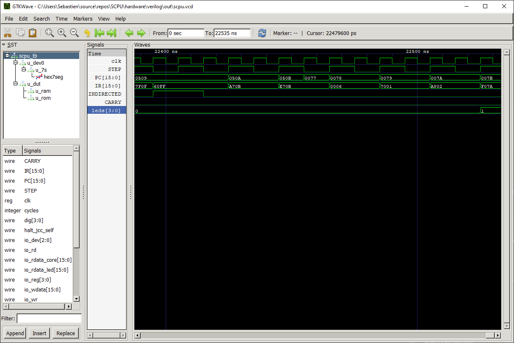
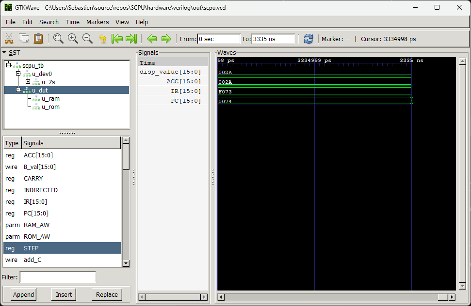

# S-CPU Verilog Implementation

This folder contains the synthesizable **Verilog implementation** of the S-CPU,
together with a simulation testbench and a simple MMIO output device.

The Verilog version provides a synthesizable **RTL implementation** for
automated validation, waveform inspection, and reuse by the FPGA port.
It preserves the S-CPU ISA and memory model while expressing the processor
as synthesizable hardware modules.

Simulation is performed with [**Icarus Verilog**](https://bleyer.org/icarus/),
and generated waveforms can be inspected with **GTKWave**.



For architecture details, see the [S-CPU Architecture guide](../../docs/architecture.md).
For ROM output formats, see the [assembler documentation](../../software/assembler/README.md).

## Repository Structure

```
verilog/
├─ rtl/                         # synthesizable RTL
│  ├─ include/
│  │  └─ scpu_defs.vh           # shared opcodes, modes, device IDs
│  ├─ scpu_core.v               # 2-phase core (S0/S1), ISA & addressing modes
│  ├─ mmio_device.v             # demo device: 4 LEDs + 4-digit 7-segment (hex display)
│  ├─ sevenseg_scan.v           # time-multiplexed 7-segment scanner (COMMON_ANODE param)
│  ├─ ram.v                     # simple 2K × 16-bit RAM (async read, sync write)
│  └─ rom.v                     # 64K × 16-bit ROM; loads INIT_FILE (default: "sim/rom.hex")
├─ sim/
│  ├─ scpu_tb.v                 # testbench (100 MHz clock, HALT detection, VCD dump)
│  └─ rom.hex                   # S-CPU program (hex), read by rom.v at startup
├─ out/                         # generated by the script (binary + VCD go here)
└─ build.ps1                    # simple PowerShell build/run/waves/clean
```

## Requirements

* **Icarus Verilog** (`iverilog`, `vvp`) installed and on `PATH`.
* **GTKWave** (`gtkwave`) installed and on `PATH` (for waveform viewing).
* **PowerShell** on Windows.
* The S-CPU program at **`sim/rom.hex`** (hex format).
  *Note:* `rtl/rom.v` defaults to `INIT_FILE = "sim/rom.hex"`.

## Generating the ROM Image

Run these commands from the repository root:

```powershell
# Release
./scpu-assembler -f Verilog -o ./hardware/verilog/sim/rom.hex ./samples/asm/AutoTest.asm

# Source checkout
dotnet run --project ./software/assembler/SCPU.Assembler.CLI -- \
  -f Verilog \
  -o ./hardware/verilog/sim/rom.hex \
  ./samples/asm/AutoTest.asm
```

Then change to `hardware/verilog/` and run `.\build.ps1`.

## Build & Run

> ⚠️ **Run all commands from the root of the `verilog/` folder** (where `build.ps1` lives).

The script:

* creates `out/` if missing,
* compiles to `out/scpu`,
* runs the simulation from `out/` so the VCD is generated as `out/scpu.vcd`,
* opens GTKWave on demand.

### Commands

```powershell
# build + run (default if no argument)
.\build.ps1

# compile only
.\build.ps1 build

# run simulation (produces out/scpu.vcd)
.\build.ps1 run

# open GTKWave on the generated VCD
.\build.ps1 waves

# clean (remove out/)
.\build.ps1 clean
```

## How the Verilog Implementation Works

This implementation is split into a few small RTL blocks:

* `rtl/scpu_core.v` contains the main CPU state machine. It runs as a small
  two-phase machine:
  * **S0** fetches the next instruction from ROM and advances the PC.
  * **S1** executes the decoded opcode.
* `rtl/rom.v` loads `sim/rom.hex` at simulation startup with `$readmemh`, so the
  ROM contents come directly from the assembled program.
* `rtl/ram.v` implements the data RAM as a 16-bit wide memory array with 2K
  entries (`mem[0:(1<<AW)-1]`), async read, and sync write.
* `rtl/mmio_device.v` exposes the visible demo outputs: the 7-segment display
  and the LED bank.

The core state is centered around a few registers:

* `PC` for the current instruction address,
* `IR` for the fetched instruction,
* `ACC` for the accumulator,
* `CARRY` for arithmetic/branch state,
* `INDIRECTED` to track one-cycle indirection handling,
* `STEP` to track the current phase (`S0` fetch / `S1` execute),

The processor also connects to a 2K × 16-bit RAM block for data and working storage.

The testbench wires the CPU to the MMIO demo device and records a VCD trace.
That makes the observable result easy to inspect in GTKWave or on the console.

## Simulation Timing Notes (Important)

The testbench clock is configured for a **100 MHz simulated CPU clock**
(10 ns period, toggled every 5 ns in `sim/scpu_tb.v`).

This is **simulation time**, not real wall-clock runtime on your PC.
With full VCD dumping enabled, writing all waveform traces can be slow.
In practice, this setup traces a window of about **1,000,000 cycles**
(about **10 ms simulated** at 100 MHz), and that capture can take roughly
**15-20 seconds** of real time on a typical PC, depending on machine speed and I/O.
That 10 ms simulated window is usually enough to validate S-CPU/SCode programs
that produce a deterministic visible result.

For this reason, avoid long-delay firmware patterns in RTL simulation
(for example, human-visible blink delays with long software wait loops).

Simulation approach for this repository:

* Use short, deterministic validation programs.
* Prefer a visible final state on the LED bank or 7-segment display.
* Avoid long human-time delay loops in RTL simulation.

## Demo Flows

The default validation flow is **AutoTest** (source:
[`samples/asm/AutoTest.asm`](../../samples/asm/AutoTest.asm)).

`sim/rom.hex` in this folder is already assembled and ready to run for this
AutoTest scenario.

1. Run the `build.ps1` script from the `verilog/` folder.
2. Open `out/scpu.vcd` in GTKWave.
3. Inspect `u_dev0.led4[3:0]` and confirm it reaches `4'b0001` at the end,
  matching the AutoTest program PASS condition.

For a second functional example, use **ArithmeticAndShifts** (source:
[`samples/asm/ArithmeticAndShifts.asm`](../../samples/asm/ArithmeticAndShifts.asm)).

1. Assemble the program in Verilog format from the repository root:

  ```powershell
  ./scpu-assembler -o ./hardware/verilog/sim/rom.hex -f Verilog .\samples\asm\ArithmeticAndShifts.asm
  ```

2. Then change to `hardware/verilog/` and run `build.ps1`, then open `out/scpu.vcd`.
3. Inspect `u_dev0.disp_value` and confirm it reaches `16'h002A`.
4. Check CPU trace signals (`ACC`, `IR`, `PC`) and confirm `PC` stops at `0x74`
  for this program.



The key visible MMIO outputs exposed by device 0 are:
* register `0x1` (hex display) via `u_dev0.disp_value`,
* register `0x2` (LED bank) via `u_dev0.led4[3:0]`.

This register map is the same one used across the other S-CPU implementations
(desktop/CLI simulators and hardware targets such as Gowin, Logisim, and Digital),
so program-visible MMIO behavior remains consistent.

For ISA behavior details beyond this quick flow, see the
[S-CPU Architecture guide](../../docs/architecture.md) and the demo source files
linked above.

## Running Without the Script (for reference)

### 1) Compile (Icarus Verilog)

```powershell
iverilog -g2012 -Wall -Wimplicit -Wportbind -Wtimescale -Wselect-range `
  -I rtl/include `
  -o out/scpu `
  rtl/rom.v rtl/ram.v rtl/sevenseg_scan.v rtl/mmio_device.v rtl/scpu_core.v sim/scpu_tb.v
```

### 2) Run (Icarus simulator)

```powershell
vvp out/scpu
```

This generates `out/scpu.vcd`.

### 3) View Waves (GTKWave)

```powershell
gtkwave out/scpu.vcd
```
