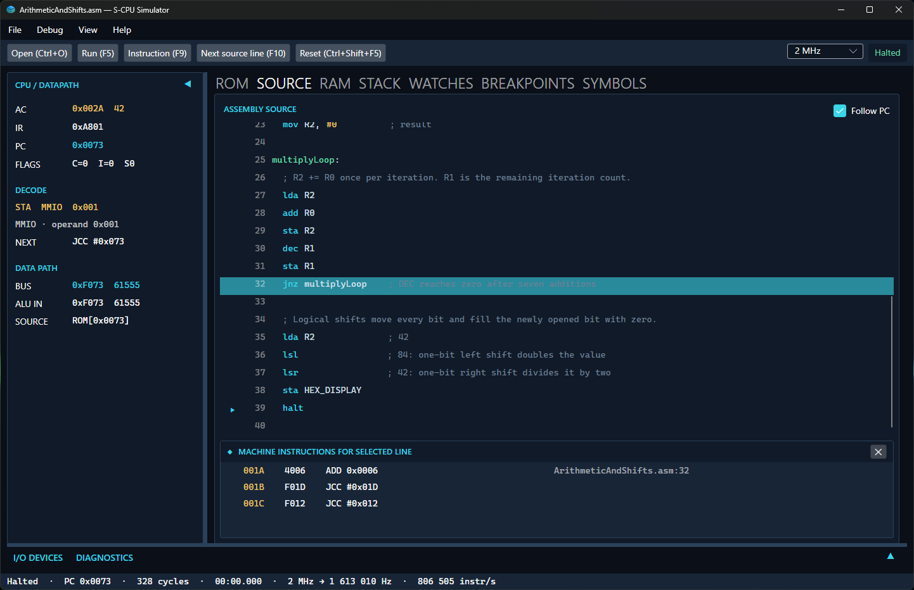
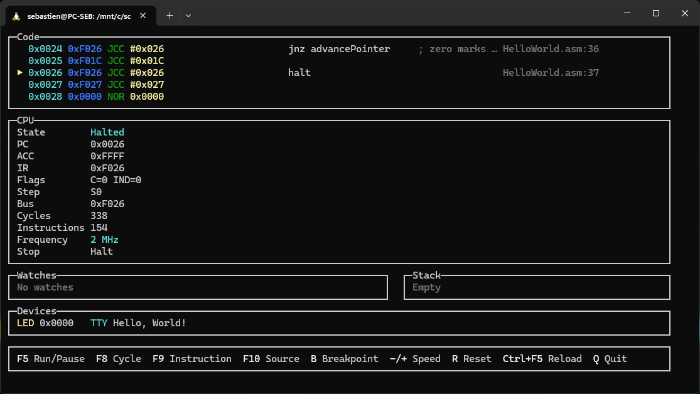
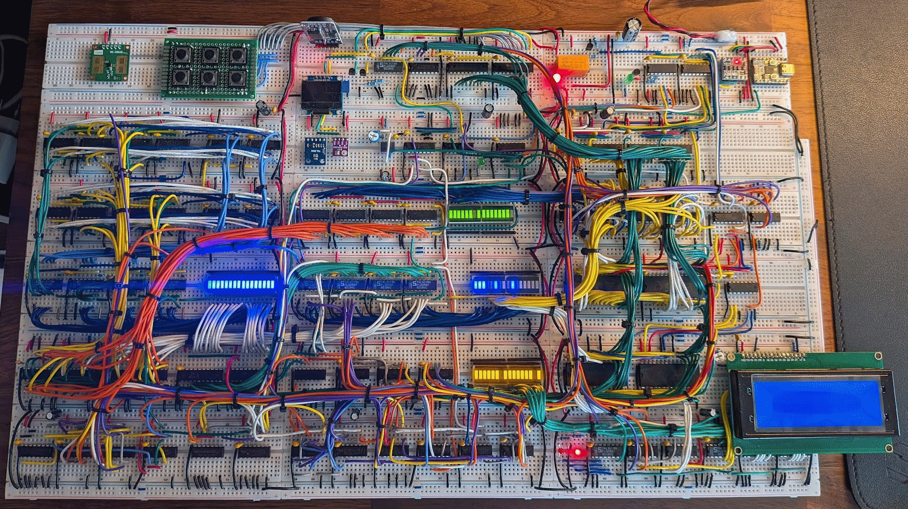
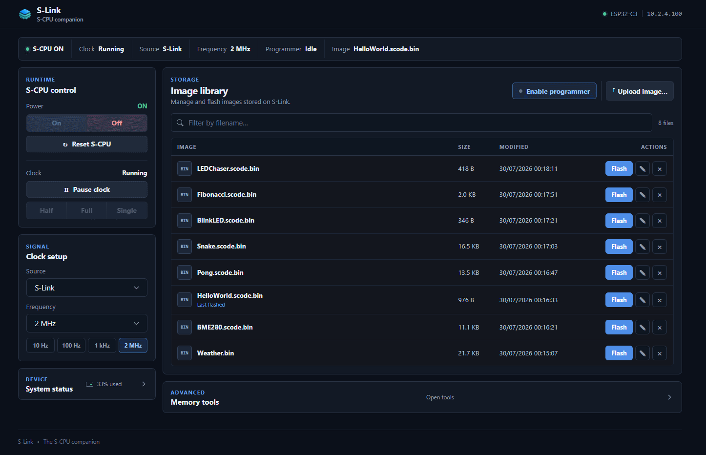

<p align="center">
  <a href="https://buildacpu.com">
    
  </a>
</p>

<h1 align="center">S-CPU</h1>

<p align="center">
  <em>A minimalist 16-bit computer built from logic gates to code.</em>
</p>

**S-CPU** is a **hands-on educational computer project** and a personal journey
into how computers work, connecting **digital logic**, **processor architecture**,
**physical hardware**, **software tools**, and **high-level programming languages**.

This repository contains the complete S-CPU ecosystem: a **minimalist 16-bit architecture**
implemented across **logic simulation**, **HDL**, **FPGA**, and **physical 74xx TTL hardware**,
together with its own assembly language, **S-Code high-level language and compiler**,
simulators, firmware, libraries, and sample programs.

## BuildACPU.com

S-CPU is the practical implementation project behind
[**BuildACPU.com**](https://buildacpu.com), **“Build a CPU from logic gates to code.”**

BuildACPU.com is the **learning side** of the project: it explains the concepts,
connects the hardware and software layers, and provides articles, tutorials,
and hands-on experiments.

This repository is the **implementation and reference side**: it contains the
runnable S-CPU system, source code, hardware designs, development tools, and
technical documentation.

## 🧩 Overview

S-CPU is both an **educational platform** and a **functional computer**.

It runs both **assembly programs** and software written in **S-Code**, its custom
C-inspired high-level language.

The repository is organized into three main areas:

| Area | Description |
| ---- | ----------- |
| **Hardware** | CPU designs and implementations, from logic simulation to FPGA and physical TTL hardware |
| **Firmware** | **S-Link**, the ESP32-based companion used to control, program, and inspect the physical S-CPU |
| **Software** | Assembler, compiler, simulators, libraries, and development tools built around the S-CPU architecture |

## 🧠 Architecture

S-CPU is a **16-bit accumulator-based architecture** built around only four
native instructions: `NOR`, `ADD`, `STA`, and `JCC`.

Instructions support several addressing modes, including direct memory access,
immediate values, and indirection. All S-CPU implementations share the same ISA
and ROM format.

Read the dedicated [**S-CPU Architecture guide**](./docs/architecture.md) for
the instruction encoding, addressing modes, execution cycle, memory model,
MMIO layout, and assembler abstractions.

## 🚀 Quick Start

The fastest way to discover S-CPU is to run a source program directly in the
desktop simulator or the CLI. The simulator can assemble `.asm` files and
compile `.scode` files in memory, so you can iterate without intermediate exports.

### 1. Start with the desktop simulator

The desktop simulator is cross-platform. Release packages are available for
Windows and Linux, and macOS can be built from source.

Download the desktop simulator from the project Releases, extract it, and run:

```powershell
./scpu-simulator
```

Open `samples/scode/HelloWorld.scode`, press **Run**, and explore source,
ROM, RAM, stack, symbols, watches, and terminal views.



The desktop simulator can also open a program as soon as it starts. Pass an
assembly (`.asm`) or S-Code (`.scode`) file on the command line, either to a
packaged release or when running the simulator from source:

```powershell
# Release
./scpu-simulator samples/scode/HelloWorld.scode

# Source checkout (.NET 10 SDK required)
dotnet run --project software/simulator/SCPU.Simulator.Desktop -- samples/scode/HelloWorld.scode
```

See the [Desktop Simulator guide](./software/simulator/SCPU.Simulator.Desktop/README.md)
for the complete interface and debugging workflow.

### 2. Try the CLI simulator

The CLI simulator is built for terminal-first workflows, repeatable testing, and
scripted execution. It keeps the loaded program, symbols, breakpoints, and memory
state alive across commands.



```text
scpu> load samples/scode/HelloWorld.scode
scpu> debug
```

For a complete non-interactive run:

```powershell
# Release
./scpu load samples/asm/HelloWorld.asm -- run

# Source checkout
dotnet run --project software/simulator/SCPU.Simulator.CLI -- load samples/asm/HelloWorld.asm -- run
```

The CLI also supports repeatable assertions. For example, the minimal S-Code
program finishes with 42 in the accumulator:

```powershell
./scpu load samples/scode/Minimal.scode -- run -- assert reg acc = 42
```

See the [CLI guide](./software/simulator/SCPU.Simulator.CLI/README.md#automation)
for every assertion target, operator, and register alias.

### 3. Build a ROM image

When you are ready to target Digital, Logisim, FPGA, or the physical S-CPU TTL,
use the assembler or S-Code compiler:

```powershell
# Assemble an assembly source into the 16-bit hexadecimal ROM format used by Digital and Logisim
./scpu-assembler -f Logisim16 -o hardware/digital/rom.hex samples/asm/AutoTest.asm

# Compile an S-Code program into a raw binary ROM image
./scode-compiler -f Binary -o blink.bin -d FREQ_HZ=2_000_000 samples/scode/BlinkLED.scode
```

See the [software guide](./software/README.md), [assembler reference](./software/assembler/README.md),
[S-Code reference](./software/compiler/README.md), and [sample catalog](./samples/README.md)
for the next steps.

## ⚙️ Hardware Implementations

The [`hardware/`](./hardware) directory gathers all representations of the CPU and its environment:

1. [`logisim/`](./hardware/logisim) → **Logisim** implementation, a gate-level prototype that makes the architecture visible and easy to explore.
2. [`digital/`](./hardware/digital) → **Digital** simulation reproducing the CPU with 74xx TTL logic chips for validation and layout planning.
3. [`scpu-ttl/`](./hardware/scpu-ttl/) → **Physical 16-bit CPU** built on **18 breadboards** using 74xx-series logic ICs.
4. [`verilog/`](./hardware/verilog) → **HDL implementation** for Icarus Verilog simulation and hardware verification.
5. [`gowin/`](./hardware/gowin) → **FPGA port** running on the **Tang Primer 25K** board.

Every implementation shares the same ISA and ROM format, allowing compatible
programs to move unchanged from simulation to FPGA and physical TTL hardware.



A **PCB version** of the S-CPU TTL is currently under development.
A longer-term goal is to reimplement the architecture using discrete transistors,
bringing the design back to the most fundamental level of computation.

## 💻 Software Toolchain

The complete development environment lives under [`software/`](./software),
providing a unified toolchain for writing, assembling, compiling, and simulating
programs for the S-CPU.

### 🧱 S-CPU Assembler

* Translates human-readable assembly (`.asm`) into **S-CPU machine code**.
* Multiple output formats: Binary, IntelHex, Logisim16, Verilog, Gowin, annotated listings & symbol tables.
* Includes a CLI application and reusable .NET libraries.

[📘 Read the Assembler Documentation](./software/assembler/README.md)

### 🧩 S-Code Compiler

* Compiles S-Code, a **high-level language inspired by C and C#**, designed specifically for the S-CPU.
* Implements the compiler logic: ANTLR grammar, lexer, parser, semantic analysis, and assembly generator.
* Command-line tool that compiles `.scode` sources into S-CPU assembly or binary outputs.
* xUnit test suite (250+ tests) covering control flow, functions, expressions, and error handling.

[📘 Read the Compiler Documentation](./software/compiler/README.md)

### 🧪 S-CPU Simulator Desktop

* Graphical simulator and debugger frontend for the S-CPU.
* Loads ROM, assembly and S-Code files, then shows ROM, source, RAM, stack,
  symbols, watches and breakpoints in a debugger-style workspace.
* Cross-platform: release packages for Windows and Linux, and source builds
  for macOS.
* Uses the shared simulator engine so behavior matches the CLI and the
  underlying processor model.
* Ideal for interactive exploration, visual debugging and step-by-step analysis.

[📘 Read the Desktop Simulator documentation](./software/simulator/SCPU.Simulator.Desktop/README.md)

### 🔧 S-CPU Simulator CLI

* Terminal simulator for scripts, CI and repeatable automation.
* Cross-platform: runs on Windows, Linux and macOS from the same
  .NET-based codebase.
* Uses the same shared simulator engine as the desktop frontend.
* Loads assembly and S-Code directly in memory, then runs, steps, inspects
  registers, memory, breakpoints and device I/O from a single shell.

[📘 Read the CLI Simulator documentation](./software/simulator/SCPU.Simulator.CLI/README.md)

Both frontends are built on shared .NET libraries for the processor model,
debug sessions, symbols, snapshots, and MMIO devices, so the same API can be
used directly from your own .NET code.

➡️ Full details in [software/README.md](./software/README.md).

## 🌐 Firmware – S-Link

[`firmware/slink/`](./firmware/slink) hosts **S-Link**, the browser-based control,
programming, and inspection companion for the **S-CPU TTL**.

It runs on an **ESP32** and provides a direct interface between the user, through
a web browser, and the physical processor.

From its built-in web dashboard, you can:

* **Power, reset, and clock** the S-CPU in real time
* **Switch clock sources** between the standalone NE555 oscillator and ESP32-generated PWM
* **Adjust frequency, pause execution, and advance the clock manually**
* **Upload, erase, verify, and flash** ROM images directly from the browser
* **Inspect ROM and RAM**, capture the complete RAM, and decode the S-CPU runtime layout
* **Monitor system state and programming progress** live through Server-Sent Events (SSE)



➡️ Full details in [firmware/slink/README.md](./firmware/slink/README.md).

## 🧪 Samples

Ready-to-use examples are provided in [`samples/`](./samples):

* [`samples/asm/`](samples/asm/) – Assembly demos and shared routines
* [`samples/scode/`](samples/scode/) – S-Code demos and reusable libraries

The samples can be assembled or compiled and run on their supported targets.

Follow the [guided sample catalog](./samples/README.md) to identify the required simulator or hardware devices.

## 💡 Philosophy

S-CPU is not just about making a CPU; it's about **making it understandable, tangible, and elegant**.
Each layer, from logic gates to compiler, is designed to be transparent and reproducible.

Ultimately, the goal is to create a computer that's:

* **Simple enough** to be built from transistors
* **Usable enough** to run real programs
* **Connected enough** to live in the modern world
* **Beautiful enough** to sit proudly on a desk

## 🌍 Origins and Inspirations

S-CPU grew out of a personal journey into computer architecture that began in
2022, after discovering [**Ben Eater's 8-bit computer**](https://eater.net/8bit)
and the wider world of homebrew computing.

Over the following two years, I explored digital logic, built early breadboard
experiments, studied minimalist processor designs, and recreated complete
computers in simulation. What started as an effort to understand how a CPU works
at the gate level gradually evolved into a larger goal: designing my own
processor and following the entire stack, from hardware logic to assembly,
compilers, software tools, and real programs.

By 2024, that idea had become S-CPU: a processor designed to remain simple
enough to understand and build from basic logic, while still being capable
enough to support a complete and usable computer ecosystem.

Several projects and resources strongly influenced that journey:

* [**Ben Eater's 8-bit computer**](https://eater.net/8bit) — an accessible introduction to breadboard CPU design and digital logic
* [**Computer Time Travel**](https://books.google.fr/books/about/Computer_Time_Travel.html?id=JksyMQAACAAJ) by J. S. Walker — a transistor-level exploration of the JMPM microprocessor
* [**Nand2Tetris**](https://www.nand2tetris.org/) — a complete journey from logic gates to a computer, compiler, and software stack
* [**Build Your Own Computer — From Scratch**](https://whippleway.com/BYOC/AboutBYOC.htm) by Richard Whipple — a step-by-step computer design implemented in Logisim and FPGA
* [**Minimal 64**](https://github.com/slu4coder/The-Minimal-64-Home-Computer) — a minimalist 8-bit TTL home computer
* [**Gigatron TTL**](https://gigatron.io/) — a TTL computer built without a conventional microprocessor
* [**Q2 Computer**](https://joewing.net/projects/q2/) — a 12-bit bit-serial computer built from discrete transistors
* [**TraNOR**](http://mynor.org/tranor.htm) — a computer built from discrete transistors and NOR-based logic
* [**Ken Boak's CPU projects**](https://github.com/monsonite) — experimental processor designs spanning TTL, FPGA, bit-serial, and minimalist architectures
* [**Astro-8**](https://github.com/sam-astro/Astro8-Computer) — a 16-bit computer project with simulation, emulation, assembly, and a high-level language

The initial instruction-set foundation was inspired by
[**Tim Böscke's MCPU**](./docs/references/mcpu.pdf), an 8-bit accumulator CPU
designed in 2001 to fit within a 32-macrocell CPLD. MCPU demonstrated that a
useful processor could be built around only four native instructions:
`NOR`, `ADD`, `STA`, and `JCC`.

S-CPU keeps those four operations as its minimal native core and develops the
idea into a complete 16-bit computer architecture, with its own hardware
implementations, assembler, high-level language, compiler, simulators, firmware,
libraries, and sample programs.

## 🛠️ Tech Stack

* **Hardware:** 74xx TTL, Logisim, Digital, Verilog, Gowin FPGA
* **Firmware:** ESP32 / PlatformIO (C++)
* **Software:** C#, .NET 10, Avalonia, Spectre.Console, ANTLR, xUnit

## 📜 License

Licensed under the **MIT License** for study, modification, and experimentation.
