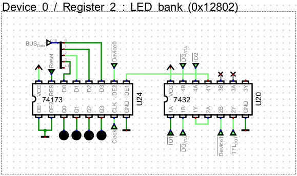

# S-Code Compiler

**S-Code** is a high-level programming language inspired by **C** and **C#**, specifically designed for the **S-CPU**.
It bridges the gap between **low-level assembly** and **structured programming**, offering a more readable and modular way to write code for a minimalist CPU.

It is an **experimental language**, still evolving, with its own rules and constraints.
While it borrows familiar syntax from C-like languages, it does not behave exactly like C, and many features are only partially implemented.

The compiler is written in **C#** and uses **ANTLR** for **lexical and grammar parsing**.
It builds an **Abstract Syntax Tree (AST)**, performs semantic checks, and generates **S-CPU assembly** ready for execution.

## 1. Project Structure

The S-Code compiler is organized into three main projects:

* **SCode.Compiler.CLI**
  Command-line application to compile S-Code source files into S-CPU assembly or directly into binary formats.

* **SCode.Compiler.Core**
  Core .NET library implementing the compiler. It includes the ANTLR grammar, lexer, parser, semantic analysis, and assembly generator.

* **SCode.Compiler.Tests**
  Unit tests built with **xUnit**, ensuring correctness of parsing, semantic rules, and code generation.
  The test suite includes **220+ unit tests** covering control flow, function calls, expressions, and error handling.

## 2. CLI Usage

Each example shows both supported workflows: the `scode-compiler` launcher
from a Release and the equivalent command from a source checkout.

```sh
Usage:
  ./scode-compiler <file> [options]

Arguments:
  <file>  File to compile

Options:
  -?, -h, --help                    Show help and usage information
  --version                         Show version information
  -o, --output <path>               Write output to the specified file
  -f, --format <format>             The output format [default: Annotated]
  -d, --define <KEY[=VALUE]>        Define assembler constants (e.g. -d KEY or -d KEY=VALUE)
  -p, --print                       Print the output to the console 
  -q, --quiet                       Suppress console logging output
  -u, --post <URL>                  POST the final output to the specified URL (e.g. http://slink.local/upload)
```

### Output formats

* **Annotated** – Human-readable annotated listing for debugging and inspection
* **Binary** – Raw 16-bit big-endian binary image (MSB then LSB)
* **IntelHex** – Intel HEX formatted output
* **Logisim16** – Word-oriented hex dump for Logisim memories
* **Verilog** – `$readmemh`-compatible ROM image (one word per line)
* **Gowin** – ROM initialization format for Gowin FPGA IPs
* **Symbol** – Plain-text symbol table listing all constants and labels (`NAME=0xXXXX` per line)
* **Assembly** – Plain-text assembly generated by the compiler (without assembler phase)

### Examples

#### Print annotated assembly to console

```sh
# Release
./scode-compiler ./samples/scode/BlinkLED.scode -p

# Source checkout
dotnet run --project ./software/compiler/SCode.Compiler.CLI -- ./samples/scode/BlinkLED.scode -p
```

#### Save compiled binary

```sh
# Release
./scode-compiler -f Binary -o ./blink.bin ./samples/scode/BlinkLED.scode

# Source checkout
dotnet run --project ./software/compiler/SCode.Compiler.CLI -- -f Binary -o ./blink.bin ./samples/scode/BlinkLED.scode
```

#### Show raw generated assembly only

```sh
# Release
./scode-compiler -f Assembly -p ./samples/scode/BlinkLED.scode

# Source checkout
dotnet run --project ./software/compiler/SCode.Compiler.CLI -- -f Assembly -p ./samples/scode/BlinkLED.scode
```

#### Compile for Gowin FPGA

```sh
# Release
./scode-compiler -d FREQ_HZ=81_000_000 -f Gowin -o ./hardware/gowin/src/gowin_dpb/rom.mi ./samples/scode/BlinkLED.scode

# Source checkout
dotnet run --project ./software/compiler/SCode.Compiler.CLI -- -d FREQ_HZ=81_000_000 -f Gowin -o ./hardware/gowin/src/gowin_dpb/rom.mi ./samples/scode/BlinkLED.scode
```

#### Compile for S-CPU TTL and upload via S-Link

```sh
# Release
./scode-compiler -d FREQ_HZ=2_000_000 -f Binary -u http://slink.local/upload ./samples/scode/BlinkLED.scode

# Source checkout
dotnet run --project ./software/compiler/SCode.Compiler.CLI -- -d FREQ_HZ=2_000_000 -f Binary -u http://slink.local/upload ./samples/scode/BlinkLED.scode
```

## 3. Language Reference

### 3.1 Data Types

S-Code supports several primitive types, all stored in **16-bit word memory** by default.

| Type      | Description                                                      |
| --------- | ---------------------------------------------------------------- |
| `int`     | 16-bit **unsigned integer** (signed integers not yet supported)  |
| `bool`    | Alias of `int` – `0` = false, any non-zero = true                |
| `char`    | 8-bit character stored in a 16-bit word                          |
| `string`  | Pointer to a null-terminated sequence of `char`                  |
| `long`    | 32-bit integer (⚠️ partial support)                              |
| `decimal` | Fixed-point decimal (⚠️ partial support)                         |
| `struct`  | User-defined type (⚠️ partial support)                           |
| `array`   | Fixed-size memory block of homogeneous elements                  |

Arrays can be declared in one or more dimensions (e.g. `int matrix[2,2]`, `int cube[2,2,2]`). However, **nested arrays (array of arrays)** are **not supported**.

### 3.2 Variables

Variables in S-Code follow a syntax similar to C, with explicit typing and optional modifiers.

```C
int a;                 // Declaration only
int b = 42;            // Declaration with initialization
const int Max = 100;   // Read-only variable
static int Counter = 0;// Persistent variable across calls
```

#### `const` variables

* Declared with the `const` modifier before the type.
* Must be initialized at declaration.
* Are **read-only** after initialization — the compiler forbids reassignment.
* Unlike C, they are **not compile-time constants**, but **immutable runtime variables** (similar to `readonly` in C#).
* The variable's value is never stored in RAM — all accesses directly read from ROM (Program Data segment). Without const, the value is copied into RAM during initialization.

```C
const int LIMIT = 10;
int counter = LIMIT;  // ✅ OK
LIMIT = 5;            // ❌ Error: cannot modify a const variable
```

⚠️ Constant expressions like `const int X = 1 + 2;` are not yet evaluated at compile time.

#### `static` variables

* Declared with the `static` modifier before the type.
* Persist between function calls: their value is retained across invocations.
* Internally, the compiler generates a hidden boolean flag to ensure the static variable is initialized only once.
* Static variables are allocated in a persistent global memory region, not on the call stack, even though their scope remains limited to the function or block where they are defined.

```C
void Increment() {
  static int count = 0;
  count++;
  PrintNumber(count);
}
```

This guarantees single-time initialization and lifetime persistence while keeping the variable scoped locally to its definition.

#### Arrays

Arrays are contiguous memory regions containing elements of a single type.
The brackets follow the **identifier**, not the type.

```C
int numbers[] = { 6, 9, 3, 8, 0, 4 };
int matrix[,] = { { 4, 5 }, { 6, 7 } };
```

In this form, memory is **allocated in RAM**, and the size is **inferred automatically** from the initializer (`numbers` = 6 elements, `matrix` = 2×2 = 4 elements).

If no initializer is provided, the size must be **explicitly defined** using literal dimensions:

```C
int numbers[6];
int matrix[2,2];
char buffer[20]
```

Arrays can be multi-dimensional without limit (`int space[4,4,4];`) but **nested arrays (array of arrays)** are not supported.

##### Memory model

* Regular arrays (without `const`) are **allocated in RAM**, and initialized at startup.
* Declaring an array as **`const`** places it **entirely in ROM (Program Data)** — no RAM is used.  Its values are read-only and directly accessed from program memory.

```csharp
const int lookup[] = { 1, 2, 3, 4 };  // stored in ROM
int buffer[4];                        // stored in RAM
```

If `const`, the compiler omits all initialization code and references the data directly from the ROM segment.

##### Address and access

* Elements are indexed using `[index]`.
* The address of an **array** or an **element** can be obtained with the `&` operator:

```csharp
int xs[] = { 10, 20, 30 };
int* p = &xs;        // pointer to first element
int* q = &xs[2];     // pointer to third element
```

##### Limitations

* Array sizes and initializers must use **literal values** (no expressions or consts).
  ```C
  const int BASE = 10;
  int values[] = { BASE + 1 };  // ❌ Not supported
  int values[BASE];             // ❌ Not supported
  int values[10];               // ✅ OK
  ```
* Arrays cannot yet be declared on the stack (use `static` in functions).
* Passing arrays by value is not supported — use pointers instead.
* Dereferencing via pointer (`*p`) is read-only.
* Nested arrays (array of arrays) are not supported.

### 3.3 Strings

A `string` is internally represented as a **pointer to a null-terminated array of `char`**.

```csharp
string s = "Hello";
```

#### Memory model

| Declaration              | Storage                    | Description                         |
| ------------------------ | -------------------------- | ----------------------------------- |
| `const string s = "Hi";` | ROM (Program Data)         | Pointer stored in ROM, immutable    |
| `string s = "Hi";`       | RAM (pointer) → ROM (data) | Pointer in RAM, data literal in ROM |

All **string literals** are stored in **Program Data (ROM)**, even if the variable resides in RAM.

#### Size and length

* `sizeof(string)` always returns **1** (the size of a 16-bit pointer).
* To get the actual text length, use `strlen()` (in `core/strings`).

```csharp
#include "core/string"
const string t = "test";
int a = sizeof(t);   // 1 word (pointer)
int b = strlen(t);   // 4 chars
```

When allocated, a string literal occupies `strlen + 1` characters in ROM (includes `\0` terminator).

#### Pointer semantics

Strings are pointers — assigning or passing them **copies the address**, not the content.

```csharp
string t1 = "S-CPU";
string t2 = t1;      // both point to same address
t1 == t2;            // true (same pointer)
```

Use `strcmp()` for content comparison:

```csharp
assert(strcmp("Hi", "Hi") == true);
assert(strcmp("Hi", "Bye") == false);
```

#### Arrays of strings

A string array is an array of pointers to character data:

```csharp
string texts[] = { "Hello", "S-CPU" };
const string ctexts[] = { "Hello", "S-CPU" };
```

If declared `const`, both the pointer array and data remain in ROM.
Otherwise, the pointer array resides in RAM (but strings still point to ROM literals).

Example:

```csharp
string t0 = texts[0];  // pointer copy
char a0 = t0[0];       // reads first char ('H')
```

##### Character access and pointer arithmetic

A `string` behaves like a pointer: `t[i]` reads the character at address `*(t + i)`.

```csharp
string s = "Hello";
assert(s[0] == 'H');
assert(s[1] == 'e');

char* c = s;
assert(*(c + 2) == 'l');
```

#### Example: manual buffer string

You can allocate writable memory for string manipulation using a `char` array:

```csharp
char buf[16];
string s = &buf;

s[0] = 'H';
s[1] = 'i';
s[2] = '\0';

assert(strcmp(s, "Hi") == true);
```

Reassigning a string updates its pointer:

```csharp
s = "Seb";
assert(strcmp(s, "Seb") == true);
```

#### String library (`core/strings`)

```csharp
int strlen(string str) {
  char* pointer = str; int base = pointer;
  while (*pointer != '\0') { ++pointer; }
  return pointer - base;
}

bool strcmp(string str1, string str2) {
  char* p1 = str1; char* p2 = str2;
  while (*p1 == *(p2++)) {
    if (*(p1++) == '\0') return true;
  }
  return false;
}
```

#### Summary

| Feature            | Description                                 |
| ------------------ | ------------------------------------------- |
| `string` type      | pointer to `char[]`                         |
| `sizeof(string)`   | always 1 (16-bit word)                      |
| `strlen(s)`        | number of characters before `\0`            |
| Assignment         | copies pointer (reference semantics)        |
| Comparison (`==`)  | compares addresses                          |
| `strcmp(a,b)`      | compares contents                           |
| Arrays of strings  | supported (`string text[] = { "A", "B" };`) |
| Const strings      | fully ROM-based (pointer + data)            |
| Writable strings   | via `char[]` buffer in RAM                  |
| Pointer arithmetic | supported (`s + i`, `*(s+i)`)               |
| Implicit cast      | between `string` and `char*` both ways      |

### 3.4 Pointers

Pointers store memory addresses of other variables or arrays.

```csharp
int x = 42;
int* ptr = &x;
assert(*ptr == 42);
```

Pointers in S-Code behave like `const int*` in C: they allow reading but not writing through dereference (`*ptr = value` not supported yet).

##### Pointer arithmetic

Pointers (and strings) support arithmetic operations such as `+`, `-`, `++`, `--`:

```csharp
int xs[] = { 10, 20, 30 };
int* p = &xs;
p = p + 2;
assert(*p == 30);
```

##### Dereference on any expression

Dereferencing (`*expr`) is allowed on any expression, not only named pointers:

```csharp
string items[] = { "A", "BC", "DEF" };
assert(**(&items) == 'A');
assert(**(&items + 1) == 'B');
assert(*(*(&items + 1) + 1) == 'C');
```

##### AddressOf (`&`)

The `&` operator returns the address of a variable or expression result.
For arrays, `&array` returns the address of the first element.
For strings, `&s` returns the address of the **pointer itself**, not the character array.

### 3.5 Functions

Functions in S-Code are **very similar to those in C**: they define reusable routines with parameters and optional return values.
They follow a **stack-based calling convention** with a **Frame Pointer (FP)** used to manage local variables and parameters.

```C
int add(int a, int b) {
  return a + b;
}

void hello() {
  PrintChar('H');
}
```

All arguments are passed **by value**, except `string`, which is passed **by reference**.

#### Return Values

Functions can return any supported base type (`int`, `bool`, `char`, etc.), custom (`struct`), or `void` if no value is returned.

```C
bool isEven(int n) {
  return (n % 2) == 0;
}
```

`return` immediately exits the function and optionally provides a value to the caller.

#### Call Semantics and Stack Frame

When a function is called, the compiler emits instructions that manage the stack and establish a **new frame pointer** (`FP`).

Steps of a function call:

1. If the function has a return type, a **return value slot** is first pushed on the stack — a reserved location for the callee to write its result.
2. Function **arguments** are evaluated and pushed to the stack (right to left).
3. The **return address** is then pushed, and execution jumps to the target routine via the assembler macro-instruction **`CALL`**.
4. On entry, the callee **saves the previous FP**, sets a new one at the current stack position, and allocates local variables above it.
5. When returning:
   * the return value (if any) is written to the reserved slot,
   * local variables are released,
   * the previous FP is restored,
   * and execution resumes at the caller via `RET`.

This mechanism ensures consistent stack frames for recursion, nested calls, and debugging.

#### Frame Pointer (FP)

The **Frame Pointer** marks the base of the current function's stack frame and allows stable addressing of variables and parameters relative to `FP`.
* **Arguments** are located above FP (`FP + offset`).
* **Local variables** are located below FP (`FP - offset`).

Each call creates an isolated frame, guaranteeing correct access even during recursion.

##### Example: Function call stack layout

For illustration, consider:

```C
int add(int a, int b) {
    int c = a + b;  // local variable just for demonstration
    return c;
}
```

When calling `add(2, 3)`, the stack **grows downward** in memory (addresses decrease), starting from `SP = 0x120FF` — the stack top **before** the call.

After entering the function, a new frame is established as shown below:

| Stack Address       | Content / Symbol             | Description / Comment                                     |
| ------------------- | ---------------------------- | --------------------------------------------------------- |
| 🡒 **SP = 0x120F8** | *(next free slot)*           | SP — top of stack after local allocation                  |
| **0x120F9**         | `c` (local variable)         | First local variable (`FP - 1`)                           |
| 🡒 **FP = 0x120FA** |**Old FP value** (`0x12100`) | FP — Saved previous frame pointer — current FP points here |
| **0x120FB**         | *(Return address)*           | Automatically pushed by `CALL` instruction                |
| **0x120FC**         | `a = 2`                      | First argument                                            |
| **0x120FD**         | `b = 3`                      | Second argument                                           |
| **0x120FE**         | `Result container`           | Reserved space for return value                           |
| **0x120FF**         | *(previous stack top)*       | SP before the function call                               |

##### Address references inside the function

Within the `add()` function, symbols are addressed **relative to FP**:

| Symbol   | Address (relative to FP) | Description                 |
| -------- | ------------------------ | --------------------------- |
| `FP`     | Current frame base       | Points to saved previous FP |
| `FP + 1` | Return address           | Used by `RET` instruction   |
| `FP + 2` | Argument `a`             | First parameter             |
| `FP + 3` | Argument `b`             | Second parameter            |
| `FP + 4` | Result container         | Reserved by caller          |
| `FP - 1` | Local variable `c`       | First local variable        |

##### Return sequence

When the function finishes:

1. The return value (`c`) is copied to the **result container** (`FP + 4`).
2. Local variables are released by restoring `SP = FP`.
3. The previous FP is popped and restored.
4. The processor jumps to the return address (`RET`).

At the end of the call, **FP** and **SP** return to their previous values,
and the caller retrieves the function's result from the reserved slot.

#### Recursion Example

```C
int factorial(int n) {
  if (n <= 1) return 1;
  return n * factorial(n - 1);
}
```

Each recursive call creates its own stack frame with independent locals and parameters.

#### External Functions

External functions are declared using the `extern` keyword.
They are implemented outside S-Code (usually in assembly).

```C
extern void delay(int ms);
```

Declared functions are registered in the symbol table but **no code is emitted**.
The assembler provides the actual implementation.

Example:

```C
#include "../asm/common/Delay.asm"

extern void delay(int ms);

void main() {
    while (true) {
        DigitalWrite(LED, 1);
        delay(500);
        DigitalWrite(LED, 0);
        delay(500);
    }
}
```

### 3.6 Statements

S-Code supports standard control-flow constructs.

#### Conditionals

```C
if (x < 3) { r = 1; }
else if (x == 3) { r = 2; }
else { r = 3; }
```

#### Switch / case / default

`switch` selects a branch based on an integral value. Curly braces `{}` are **required**.

Rules:

* The switch expression must be `int`/`char`/`bool` (remember: `bool` is an `int`, non-zero = true).
* `case` values must be **compile-time constants**: integer/char **literals** or `const` identifiers with a literal initializer.
  (Constant **expressions** like `1+2` are **not** evaluated at compile time yet.)
* `default` is optional; at most one.
* **Fall-through** is allowed: execution continues into the next `case` until a `break;` or the end of the switch.
* `break;` exits the `switch` (not the surrounding loop).

**Basic example**

```C
int code = 2;
int r = 0;

switch (code) {
  case 0:
    r = 10;
    break;
  case 1:
    r = 20;
    break;
  case 2:
    r = 30;
    break;
  default:
    r = 0; // fallback
    break;
}
```

#### Loops

* Braces `{}` are **mandatory** for loop bodies.
* `while` supports an optional `else` clause.
* Supports `break` and `continue`.

```C
for (int i = 0; i < 5; i++) {
  if (i == 3) continue;
  sum += i;
}

while (flag) {
  counter++;
} else {
  PrintChar('N');
}

do {
  total += value;
} while (value < 10);
```

#### Labels and Goto

```C
start:
x++;
if (x < 5) goto start;
```

### 3.7 File Inclusion

The `#include` directive imports **S-Code** or **Assembly** files.

```c
#include "core/delay"
#include "io/digitalWrite"
#include "../asm/common/Delay.asm"
```

**S-Code includes** (`.scode`, `.sc`):

* Compiled together in the same program.
* If no extension is given, the compiler looks for:

  1. Current directory
  2. `lib/` subfolder
  3. Program root
  4. `lib/` under program root
* The `lib/` prefix is implicit:
  `#include "io/digitalWrite"` can match `./lib/io/digitalWrite.scode`.

**Assembly includes** (`.asm`, `.s`, `.inc`):

* Inserted verbatim into the generated assembly.
* Must explicitly specify file extension.
* Resolved only by relative/absolute path (no probing).

### 3.8 Expressions & Operators

Operators follow C-like precedence rules. Parentheses `()` can override evaluation order.

#### 3.8.1 Primary Expressions

```C
(expr)        // grouping
foo(42)       // function call
numbers[3]    // array indexing
point.x       // struct member (partial)
```

#### 3.8.2 Unary Operators

```C
&x    // address-of
*x    // dereference (read only)
~x    // bitwise NOT
!x    // logical NOT
-x    // unary minus
++x   // pre-increment
x++   // post-increment
--x, x--
```

#### 3.8.3 Multiplicative

`*`, `/`, `%`

```C
int y = 7 / 2;  // 3
int r = 7 % 2;  // 1
```

#### 3.8.4 Additive

`+`, `-`

#### 3.8.5 Shift

`<<`, `>>`

```C
int v = 1 << 3;  // 8
```

#### 3.8.6 Relational

`<`, `<=`, `>`, `>=`

#### 3.8.7 Equality

`==`, `!=`

#### 3.8.8 Bitwise

`&`, `|`, `^`

```C
int mask = 0xF0;
int r = val & mask;
```

#### 3.8.9 Logical (short-circuited)

`&&`, `||`

```C
if (x > 0 && y < 10) { ... }
```

#### 3.8.10 Conditional (Ternary)

```C
int result = flag ? 42 : 0;
```

#### 3.8.11 Assignment

`=`, `+=`, `-=`, `*=`, `/=`, `%=`
`&=`, `|=`, `^=`, `<<=`, `>>=`

```C
x += 5;
y <<= 2;
```

#### 3.8.12 Casting & Sizeof

```C
int n = (int)'A';
int s1 = sizeof(int);      // 2 bytes
int s2 = sizeof(numbers);  // array length
```

Implicit and explicit casting is supported between compatible pointer types:

* `string` <> `char*` implicit both ways.
* Other pointer conversions require explicit casts.

```csharp
char* p = "Hi";       // implicit from string
string s = p;         // implicit from char*
```

### 3.9 Inline Assembly

Inline assembly allows direct insertion of S-CPU assembly code.

```C
void DigitalWrite(int address, int value) {
  asm("
    LDS #3, R0
    ADD IODEV
    STA R0
    LDS #4, @(R0)
  ");
}
```

* Supports **multi-line** assembly blocks.
* Inserted verbatim into the compiled output.

### 3.10 Assembly Constant Declarations

Assembly constants define **symbolic values** that are injected directly into the generated assembly output.
They are declared using the directive `#const` (not the `const` keyword) and correspond to **assembler-level constants**:

```C
#const int HEX1 = 1;
#const int LED1 = HEX1 * 2;
#const int HEX2 = LED1 + 1;
```

#### Behavior

* Declared with a `#` prefix (`#const` directive).
* Must specify a **base type** (`int`, `bool`, `char`, `long`, etc.) — no custom types, arrays, or pointers.
* The compiler performs **type validation** but does **not** evaluate the expression.
* The directive is emitted as-is into the generated assembly, and the **assembler** resolves the expression during the **assembly phase**, not during compilation.
* Once emitted, the assembler version of the directive is **typeless**.
* Constants can also be **overridden at compile time** using the CLI option:

```sh
-d NAME=VALUE
```

#### Summary

| Feature                 | `#const`                          | `const`                   |
| ----------------------- | --------------------------------- | ------------------------- |
| Level                   | Assembler-level directive         | Runtime variable          |
| Evaluated by            | Assembler (assembly phase)        | Compiler (initialization) |
| Type checking           | ✅ Yes (compile-time validation)   | ✅ Yes                     |
| Type retained in output | ❌ No                              | ✅ Yes                     |
| Expression allowed      | ✅ Yes (arithmetic and references) | ⚠️ Limited (literal only) |
| Overridable at build    | ✅ via `-d NAME=VALUE`             | ❌ No                      |
| Accessible at runtime   | ❌ No                              | ✅ Yes                     |
| Exported to assembly    | ✅ As `#const` directive           | ❌ No                      |

## 4. Standard Library

The S-Code standard library provides reusable modules for common I/O operations, core utilities, and device drivers.
Each module is included via `#include "<path>"`.

### Core Modules

| Module      | Path           | Description                            | Functions                                                            |
| ----------- | -------------- | -------------------------------------- | -------------------------------------------------------------------- |
| **Delay**   | `core/delay`   | Simple delay routine using CPU timing. | `void delay(int ms);`                                                |
| **Print**   | `core/print`   | Text and numeric output utilities.     | `void Print(string str);`<br>`void PrintNumber(int number);`         |
| **Strings** | `core/string`  | Basic string handling utilities.       | `int strlen(string str);`<br>`bool strcmp(string str, string str2);` |

### I/O Modules

| Module            | Path              | Description                                                       | Functions                                                                                      |
| ----------------- | ----------------- | ----------------------------------------------------------------- | ---------------------------------------------------------------------------------------------- |
| **DigitalWrite**  | `io/digitalWrite` | Write a digital value to an MMIO register.                        | `void DigitalWrite(int address, int value);`                                                   |
| **DigitalRead**   | `io/digitalRead`  | Read a digital value from an MMIO register.                       | `int DigitalRead(int address);`                                                                |
| **Button**        | `io/button`       | Debounced button input handling with edge detection (active-low). |                                                                                                |
| **TwoWire (I²C)** | `io/TwoWire`      | I²C communication utilities for external devices.                 | `int i2c_read16(int address, int reg);`<br>`void i2c_write8(int address, int reg, int value);` |

### Device Drivers

| Driver      | Path              | Description                                            |
| ----------- | ----------------- | ------------------------------------------------------ |
| **TTY**     | `drivers/TTY`     | Terminal device driver (Logisim & Digital simulators). |
| **HD44780** | `drivers/HD44780` | Driver for Hitachi HD44780 LCD displays.               |
| **TSL2561** | `drivers/TSL2561` | Driver for the TSL2561 light sensor (I²C).             |

### Example

```csharp
#include "core/delay"
#include "core/print"
#include "io/digitalWrite"
#include "drivers/TTY"

const int LED = 2;

while (true) {
  DigitalWrite(LED, 1);
  Print("LED ON\n");
  delay(500);

  DigitalWrite(LED, 0);
  Print("LED OFF\n");
  delay(500);
}
```

To test in Digital:

```sh
# Release
./scode-compiler -d FREQ_HZ=50_000 -f Logisim16 -o ./hardware/digital/rom.hex ./demo.scode

# Source checkout
dotnet run --project ./software/compiler/SCode.Compiler.CLI -- -d FREQ_HZ=50_000 -f Logisim16 -o ./hardware/digital/rom.hex ./demo.scode
```



## 5. Example Programs

### Blink LED

```C
#include "core/delay"
#include "io/digitalWrite"

const int DEVICE_LED   = 2;
const int DELAY_MS     = 500;

bool ledState = false;
while (true) {
    ledState = !ledState;
    DigitalWrite(DEVICE_LED, ledState ? 1 : 0);
    Delay(DELAY_MS);
}
```

### Bubble Sort

```C
int numbers[] = { 6,9,3,8,0,4,2,5,7,1 };

for (int x = 0; x < sizeof(numbers) - 1; x++) {
  for (int y = 0; y < (sizeof(numbers) - x) - 1; y++) {
    if (numbers[y] > numbers[y + 1]) {
      int t = numbers[y];
      numbers[y] = numbers[y + 1];
      numbers[y + 1] = t;
    }
  }
}
```

## 6. Roadmap & Limitations

| Feature                                          | Status                                                     | 
| ------------------------------------------------ | ---------------------------------------------------------- | 
| Core types (`int`, `bool`, `char`, `string`)     | ✅ Full support (string now pointer-based)                  |
| Arrays (1D, multi-dimensional)                   | ✅ RAM / ROM support (`const` arrays stored in ROM)         |
| Functions & recursion                            | ✅ Stack-based calls with frame pointer                     |
| Control flow (`if`, loops, `switch`, `goto`)     | ✅ Loops require braces                                     |
| Operators (unary, binary, ternary, cast, sizeof) | ✅ Full support                                             |
| Inline Assembly (multi-line)                     | ✅ Supported via `asm("...")` blocks                        |
| `const` variables                                | ✅ Read-only; accessed directly from ROM                    |
| `static` variables                               | ✅ Persistent; initialized once via compiler-generated flag |
| Pointers                                         | ✅ Read-only dereference, arithmetic supported              |
| AddressOf (`&`)                                  | ✅ On any variable or array element                         |
| Dereference (`*expr`)                            | ✅ On any expression                                        |
| String ↔ char* casts                             | ✅ Implicit both ways                                       |
| Arrays of strings                                | ✅ Supported (array of pointers to `char[]`)                |
| Unsigned integers only                           | ⚠️ Work in progress                                         | 
| Structs, long, decimal                           | ⚠️ Work in progress                                         | 
| Constant expression evaluation                   | ❌ Not yet supported                                        |
| Enum types                                       | ❌ Not supported                                            |
| Method overloading / named parameters            | ❌ Not supported                                            |
| Nested arrays (`array of arrays`)                | ❌ Not supported                                            |
