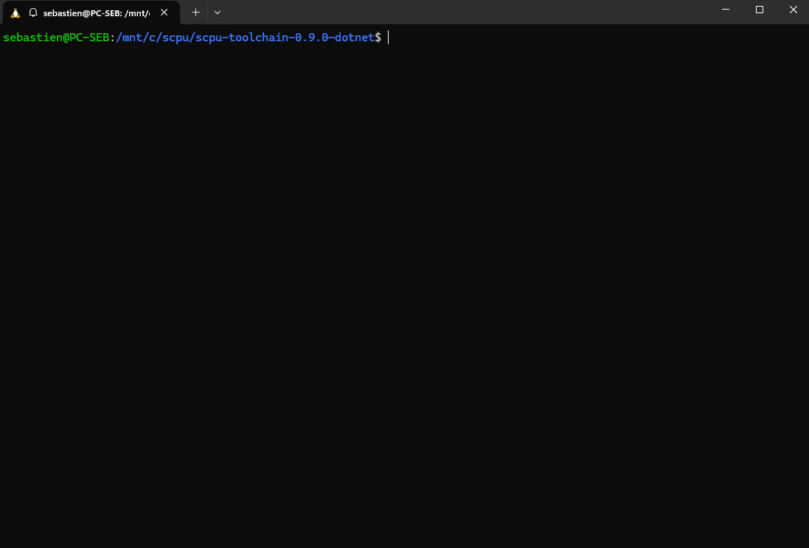
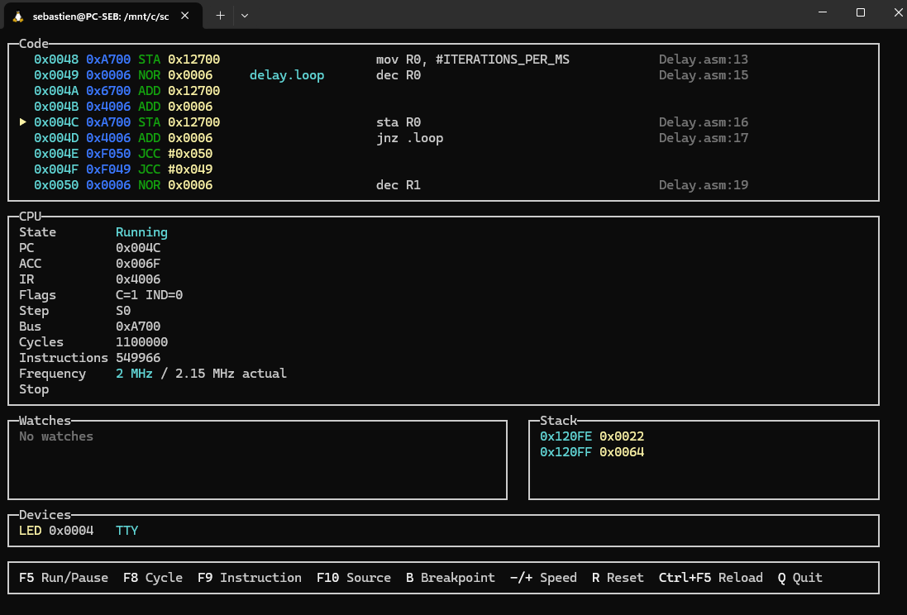
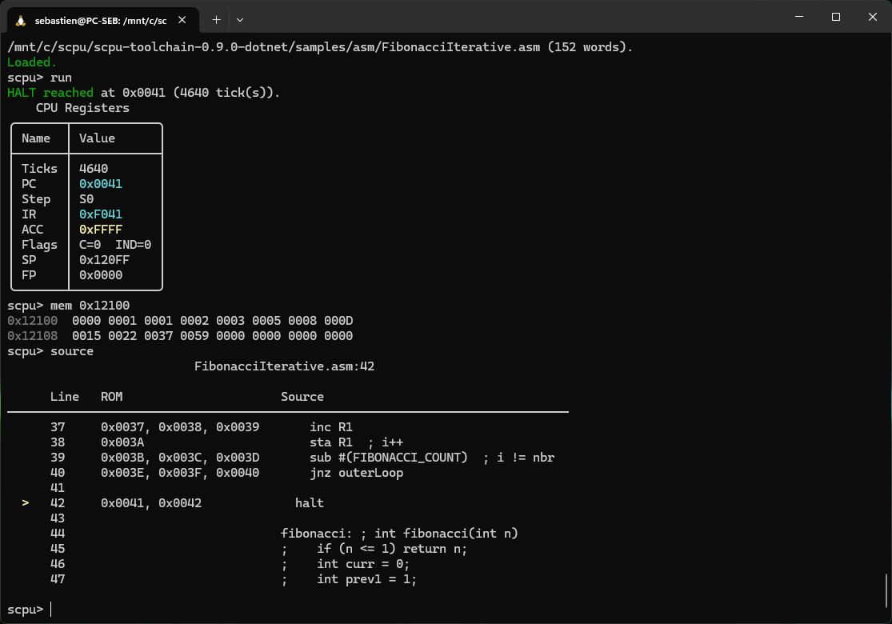
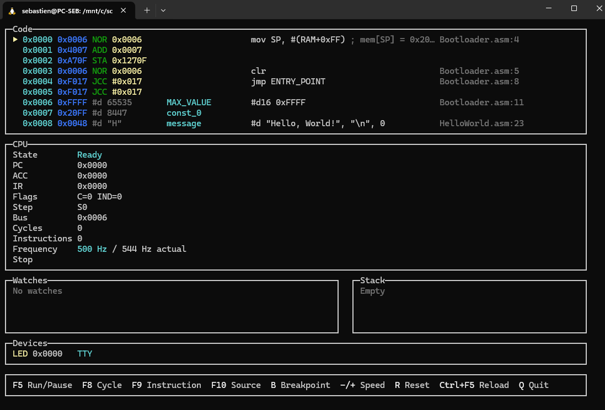
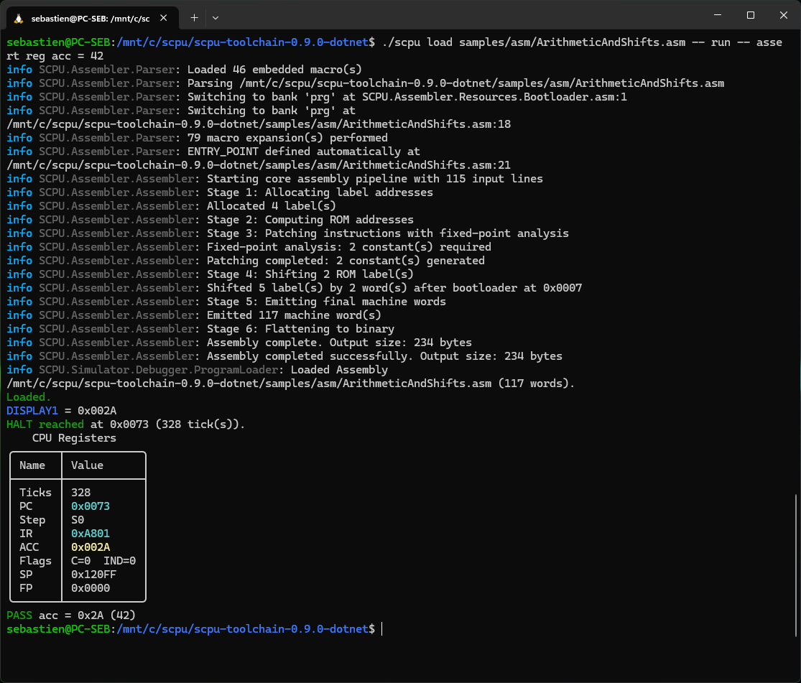

# S-CPU Simulator CLI

**S-CPU Simulator CLI** is a terminal-based simulator and debugger for S-CPU programs.

It loads binary ROM images, assembles S-CPU assembly and compiles S-Code directly in
memory. Use the persistent shell for exploratory debugging, the keyboard-driven live
view for interactive inspection, or one-shot command chains for scripts and CI.


* Load binary ROM, assembly and S-Code programs.
* Run or step by hardware cycle, instruction or mapped source line.
* Inspect registers, memory, stack, symbols, watches and annotated disassembly.
* Set symbolic breakpoints and verify program state with assertions.
* Interact with the simulated terminal and Device 0 output registers.

For the instruction set, memory map and processor architecture, see the
[S-CPU Architecture guide](../../../docs/architecture.md). The source language
and assembler are documented in the [S-Code compiler](../../compiler/README.md) and
[assembler](../../assembler/README.md) projects.

## Choose a workflow

The CLI supports three complementary ways to work.

### Persistent interactive shell

Start the simulator without a command:

```sh
# Release archive
./scpu

# Source checkout
dotnet run --project software/simulator/SCPU.Simulator.CLI
```

The shell keeps the loaded program, CPU state, symbols, breakpoints and watches alive
between commands:

```text
S-CPU Simulator CLI — type help or exit.
scpu> load samples/asm/FibonacciIterative.asm
scpu> symbols fib
scpu> break add fibonacci
scpu> run
scpu> context
scpu> step --source
scpu> context
scpu> disasm
scpu> break delete fibonacci
scpu> run
scpu> mem fibonacciValues --count 16
scpu> assert mem 0x12108 = 21
```



### Keyboard-driven live debugger

Load a program, then open the live view:

```text
scpu> load samples/asm/HelloWorld.asm
scpu> debug
```

Or directly:

```sh
# Release archive
./scpu load samples/asm/HelloWorld.asm -- debug
```



The view follows the program counter and combines annotated code, CPU state, watches,
stack and simulated device output.

| Key | Action |
| --- | --- |
| `F5` | Run or pause |
| `F8` | Step one S0/S1 hardware cycle |
| `F9` | Step one complete instruction |
| `F10` | Step to the next mapped source line |
| `B` | Toggle a breakpoint at the current PC |
| `-` / `+` | Change the simulation frequency |
| `R` | Reset |
| `Ctrl+F5` | Reload the current program |
| `Q` or `Esc` | Return to the shell |

The simulator runs at 2 MHz by default. Select a frequency from 5 Hz to 4 MHz, or remove
throttling with `max`:

```text
scpu> debug --frequency 5Hz
scpu> debug --frequency 500kHz
scpu> debug --frequency 4MHz
scpu> debug --frequency max
```

### One-shot commands and automation

Commands separated by `--` run in the same simulator process and share one debug
session:

```sh
./scpu load samples/asm/HelloWorld.asm -- run
```

Run AutoTest and verify the LED is on:

```sh
./scpu load samples/asm/AutoTest.asm -- run -- assert led = 1
```

This form is useful for repeatable tests and CI. The command chain stops as soon as one
command fails.

## Debug from symbols and source

The debugger keeps machine instructions connected to assembler labels, constants and
source locations.

```text
context                      # complete debugging context
source                       # mapped source around the current PC
disasm main --count 24       # annotated machine instructions
regs --verbose               # detailed CPU state
```

The disassembler marks the current PC and breakpoints, and shows labels and source
locations. Instructions generated from a macro are grouped under their original
assembly line.



### Run and step

`run` continues until the program reaches HALT, a breakpoint, an optional target, the
tick limit or cancellation with `Ctrl+C`.

```text
run
run --until loop
run --until 0x0120 --max-ticks 50000
```

A safety limit of 10,000,000 hardware ticks applies by default. Override it with
`--max-ticks` for an intentionally long-running program.

`step` advances by complete S-CPU instructions, including the micro-steps required by
indirect addressing:

```text
step                 # one complete instruction
step 20              # twenty instructions
step 1 --ticks       # one S0/S1 hardware cycle
step --source        # next mapped source line
```

Every stop reports its reason, address and hardware tick count, then prints the register
state.

### Breakpoints and symbols

Breakpoints accept hexadecimal or decimal addresses, labels and mapped source
locations:

```text
break add fibonacci
break add 0x0042
break add program.asm:42
break add :42
break list
break delete fibonacci
break clear
```

Use `symbols` to list labels and constants, optionally filtered by name:

```text
symbols
symbols fibonacci
```

Raw ROM images do not contain symbols or source metadata.

### Watches

Watches display current memory values without stopping execution:

```text
watch add counter
watch add 0x12802
watch add counter 0x12802
watch add 0x12100..0x1210F
watch list
```

They accept addresses, labels, constants and inclusive ranges. Lists may also be
comma-separated. Ranges are limited to 1,024 addresses.

## Inspect and patch memory

The CLI uses one developer-facing address space:

| Region | Address range |
| --- | --- |
| ROM | `0x0000–0xFFFF` |
| RAM | `0x12000–0x127FF` |
| MMIO | `0x12800–0x12FFF` |

Read memory with `mem`:

```text
mem 0x12100 --count 32
```

ROM, RAM and MMIO can also be patched during a debug session:

```text
mem 0x12100 --write 42
mem 0x0020 --write 0xF820
reload                     # restore the program from disk
```

Writing ROM changes only the in-memory simulator image. `reload` restores the program
from disk.

## Terminal and simulated devices

MMIO Device 1 implements the same TTY registers as the other S-CPU simulators:

| Register | Address |
| --- | --- |
| Output | `0x12901` |
| Buffered input | `0x12902` |
| Input available | `0x12903` |

Programs using `#include "drivers/TTY"` therefore print directly in the CLI. Input can
be queued before execution, which keeps scripted runs deterministic:

```text
tty input "hello" --new-line
run
tty status
```

[](../../../samples/asm/HelloWorld.asm)

The animation runs [`HelloWorld.asm`](../../../samples/asm/HelloWorld.asm) at a reduced
frequency so the terminal output appears one character at a time.

MMIO Device 0 exposes the sample output registers:

* `DISPLAY1` at `0x12801`;
* the LED bank at `0x12802`.

Changes are reported directly in the shell and displayed in the live debugger.

## Test programs with assertions

Assertions turn one-shot command chains into executable program tests. Failed assertions
print the actual value and return exit code `1`.

```sh
./scpu load samples/asm/ArithmeticAndShifts.asm \
  -- run \
  -- assert reg acc = 42
```



Assertions can check registers, counters, memory, the PC and simulated devices:

| Target | Syntax | Checks |
| --- | --- | --- |
| Register or counter | `assert reg <name> <operator> <value>` | Register, flag or execution counter |
| Memory | `assert mem <address> <operator> <value>` | ROM, RAM or MMIO word |
| Program counter | `assert pc <operator> <value>` | Current PC |
| LED bank | `assert led <operator> <value>` | Device 0 LED register |
| Terminal | `assert tty <operator> <text>` | Complete captured TTY output |

Numeric assertions accept `=`, `==`, `eq`, `!=`, `ne`, `<`, `<=`, `>` and `>=`.
Values and addresses may be decimal, hexadecimal or loaded symbols.

TTY assertions accept `=`, `==`, `eq`, `!=`, `ne`, `contains` and `not-contains`.

Examples:

```sh
./scpu load samples/asm/HelloWorld.asm \
  -- run \
  -- assert tty contains "Hello, World!"

./scpu load samples/asm/AutoTest.asm \
  -- run \
  -- assert led = 1 \
  -- assert reg carry = 0

./scpu load samples/asm/LongAddition.asm \
  -- run \
  -- assert mem sumHigh = 3 \
  -- assert mem sumLow = 0x25AB
```

`assert reg` accepts these names and aliases:

| Name | Meaning |
| --- | --- |
| `a`, `acc` | Accumulator |
| `ir` | Instruction register |
| `pc` | Program counter |
| `sp` | Stack pointer |
| `fp` | Frame pointer |
| `c`, `carry` | Carry flag |
| `ind`, `indirected` | Indirected-addressing flag |
| `step` | Current hardware pipeline step |
| `ticks`, `cycles` | Hardware cycles elapsed |
| `instructions` | Complete instructions executed |

## Reset, reload and edit loop

`reset` clears CPU state and RAM while keeping the current ROM image and breakpoints.

`reload` recompiles or reassembles the last source file, resets the CPU, refreshes symbols
and restores patched ROM words. This keeps the edit/run/debug loop short:

```text
scpu> load program.scode
scpu> break add main
scpu> run
# edit program.scode
scpu> reload
scpu> run
```

Raw big-endian ROM images are loaded in the same way:

```text
scpu> load build/program.bin
```

## Command reference

The sections above introduce commands in realistic workflows. The index below provides
quick navigation, while the following reference lists their main arguments and options.
For every supported option, use `./scpu <command> --help`.

| Command | Purpose |
| --- | --- |
| `shell` | Start the persistent interactive prompt |
| `load <file>` | Load binary, assemble ASM or compile S-Code |
| `reload` | Rebuild and reload the last source or image |
| `run` | Continue execution and report the stop reason |
| `debug` | Open the keyboard-driven live debugger |
| `step [count]` | Advance instructions, source lines or hardware cycles |
| `break …` | Add, delete, list or clear breakpoints |
| `symbols [filter]` | List labels, constants and addresses |
| `watch …` | Add, delete, list or clear memory watches |
| `disasm [address]` | Decode ROM words with labels and source |
| `source [location]` | Show source around PC, a symbol, address or `file:line` |
| `context` / `ctx` | Show the complete current debugging context |
| `regs [--verbose]` | Show registers, flags and optional pipeline details |
| `stack` | Inspect the current stack |
| `mem <address>` | Read or patch ROM, RAM and MMIO |
| `reset` | Reset CPU and RAM without reloading ROM |
| `tty …` | Queue terminal input and inspect captured output |
| `assert ...` | Verify registers, memory, PC, LED or TTY output |

The detailed reference intentionally repeats a few commands shown earlier, but groups
their syntax in one place for lookup.

## Detailed command reference

### shell

Start the interactive persistent shell without loading a program:

```sh
./scpu
```

The session keeps CPU state, ROM, symbols, breakpoints and watches until exit.

### load

Load a binary ROM, assemble S-CPU assembly or compile S-Code:

```text
load samples/asm/HelloWorld.asm
load samples/scode/BlinkLED.scode
load build/program.bin
```

Resets CPU state, clears breakpoints (but keeps watches). Detects file type automatically.

### reload

Rebuild and reload the last loaded source file without changing breakpoints:

```text
reload
```

Useful for the edit/run/debug cycle. Also restores any patched ROM words to their original values.

### run

Execute until HALT, breakpoint, target address or tick limit:

```text
run
run --until main
run -u 0x0120 --max-ticks 50000
run -u fibonacci
```

Options: `-u|--until <ADDRESS>` (symbol or address), `-m|--max-ticks <COUNT>` (default 10,000,000).

### reset

Reset CPU and RAM while keeping the current ROM and breakpoints:

```text
reset
```

Useful for re-running the same program without reloading it.

### step

Execute one or more instructions, source lines or hardware cycles:

```text
step                 # one complete instruction
step 10              # ten instructions
step 1 --ticks       # one S0/S1 hardware cycle
step --source        # next mapped source line
step 5 --ticks
```

Argument `[COUNT]` is optional (default 1). Options `--ticks` and `--source` are mutually exclusive.

### regs

Display current CPU registers, flags and optional pipeline state:

```text
regs
regs --verbose       # add pipeline step and detailed flag info
```

Shows accumulator, instruction register, program counter, stack pointer, frame pointer, carry flag, indirect-addressing flag, and execution counters.

### stack

Dump the current logical stack derived from S-CPU SP/FP conventions:

```text
stack
stack --count 32
```

### context / ctx

Show the complete current debugging context in one view:

```text
context          # default 8 code lines, 4 stack entries
context --code 16 --stack 8
ctx -c 16 -s 8
```

Combines registers, nearby disassembly, watches, stack and pending breakpoints.

### disasm

Disassemble ROM words with labels and source locations around an address or symbol:

```text
disasm               # around current PC
disasm main --count 24
disasm 0x0040 --no-source
disasm main -c 12 --no-source
```

Shows mapped assembly source lines and indicates current PC and breakpoints.

### source

Display source code around the current PC, a symbol, an address or a file:line location:

```text
source                   # around current PC
source program.asm:42    # at line 42
source main              # around symbol
source 0x0120            # around address
source --around 10       # show ±10 lines
```

For S-Code programs, displays generated assembly (line mappings not yet available).

### mem

Read or patch ROM, RAM and MMIO memory:

```text
mem 0x12100                    # read 16 words from 0x12100 (default)
mem 0x12100 --count 32         # read 32 words
mem 0x12100 --write 42         # write decimal value
mem 0x0020 --write 0xF820      # write hex value
mem 0x12100 -c 8 -w 100        # short form
```

Writing ROM changes only in-memory image; use `reload` to restore from disk.

### symbols

List all labels, constants and their addresses, optionally filtered by name:

```text
symbols              # list all symbols
symbols loop         # list symbols containing 'loop'
```

Argument is a case-insensitive filter; loaded from assembler constant tables and debug metadata.

### break

Manage breakpoints:

```text
break add main               # breakpoint at label
break add 0x0042             # breakpoint at hex address
break add program.asm:42     # breakpoint at source line
break list                   # list all breakpoints
break delete 0x0042          # remove breakpoint
break clear                  # remove all breakpoints
```

Breakpoints are preserved when reloading the same file.

### watch

Add persistent memory value watches:

```text
watch add counter            # watch by label/symbol
watch add 0x12802            # watch by address
watch add 0x12100..0x1210F   # watch range (inclusive)
watch add 0x12100 --to 0x1210F    # alternative range syntax
watch add counter,0x12802    # comma-separated list
watch list                   # list all watches
watch delete 0x12802         # remove by address or ID
watch delete 5               # remove watch by ID
watch clear                  # remove all watches
```

Ranges are limited to 1,024 addresses. Watches persist across program reloads.

### tty

Queue terminal input and inspect captured output (Device 1):

```text
tty input "hello"            # queue input without newline
tty input "hello" --new-line # queue with Enter key
tty input -n "world"         # short form
tty status                   # show pending input and captured output
tty clear                    # reset terminal buffers
```

Useful for scripting terminal-based programs with deterministic input.

### debug

Open the keyboard-driven live debugger (interactive view with source, CPU state, watches):

```text
debug                        # default 2 MHz
debug --frequency 1kHz       # set to 1 kHz
debug -f 500Hz               # short form
debug --frequency max        # no throttling
debug --refresh 30           # refresh display at 30 Hz
```

Options: `-f|--frequency <FREQUENCY>` selects the simulated clock, and
`--refresh <HZ>` controls the display refresh rate. The default values are 2 MHz and
15 Hz. Keyboard shortcuts are listed in the live debugger workflow above.

### assert

Verify program state and return exit code 1 on failure:

```text
assert reg acc = 42
assert reg pc < 0x200
assert mem 0x12100 = 10
assert mem counter = 0x25AB
assert pc >= 0x100
assert led = 0xFF
assert tty = "Hello, World!"
assert tty contains "Hello"
assert tty not-contains "error"
```

Register aliases: `a` (acc), `ir`, `pc`, `sp`, `fp`, `c` (carry), `ind` (indirect), `step`, `ticks`/`cycles`, `instructions`.
Numeric operators: `=`, `==`, `eq`, `!=`, `ne`, `<`, `<=`, `>`, `>=`.
TTY operators: `=`, `==`, `eq`, `!=`, `ne`, `contains`, `not-contains`.

Run `./scpu --help` for the command list or `./scpu <command> --help` for the
complete and authoritative option reference.

## Current scope

The CLI provides the source-aware debugging loop needed for live builds, symbolic
breakpoints and watches, controlled execution, annotated disassembly, state inspection
and automated assertions.

Read/write watchpoints, S-Code line mappings and call-stack unwinding require additional
instrumentation in the processor core or compiler metadata. They are intentionally not
approximated through unreliable polling.

## Architecture

* **SCPU.Simulator.Core** — processor, ROM, RAM and CPU execution.
* **SCPU.Simulator.Debugger** — program loading, source metadata, symbols, sessions,
  snapshots, breakpoints, memory patching, exports and execution control.
* **SCPU.Simulator.Devices** — reusable UI-independent MMIO devices.
* **SCPU.Simulator.CLI** — Spectre.Console commands, interactive shell, live debugger,
  dependency injection, history and completion.

The command layer remains deliberately thin. Execution rules belong to the debugger
session, CPU behavior remains in `SCPU.Simulator.Core`, and instruction encoding remains
in `SCPU.Architecture`.

Only connected peripherals are registered. CPU reads from unconnected MMIO addresses
return zero and writes are ignored, matching the core bus behavior. An explicit debugger
write to an unconnected device reports an error.
