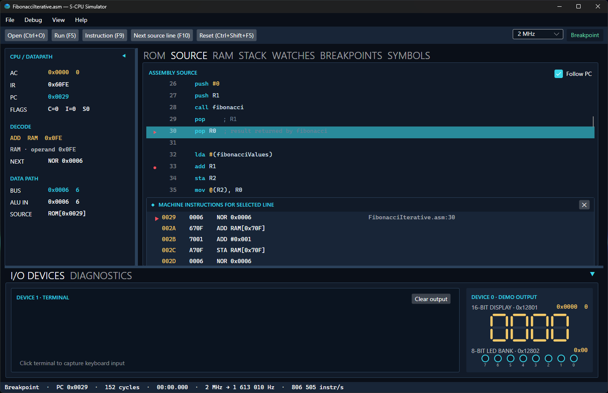
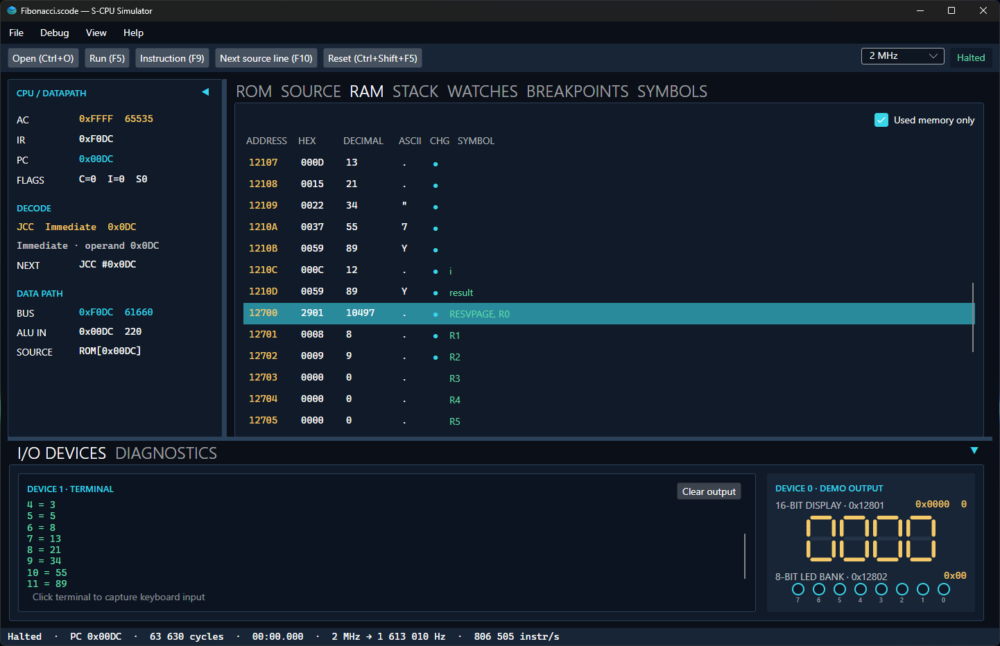
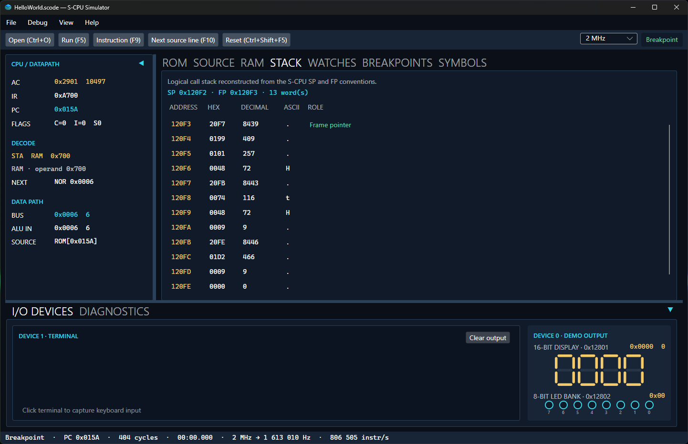
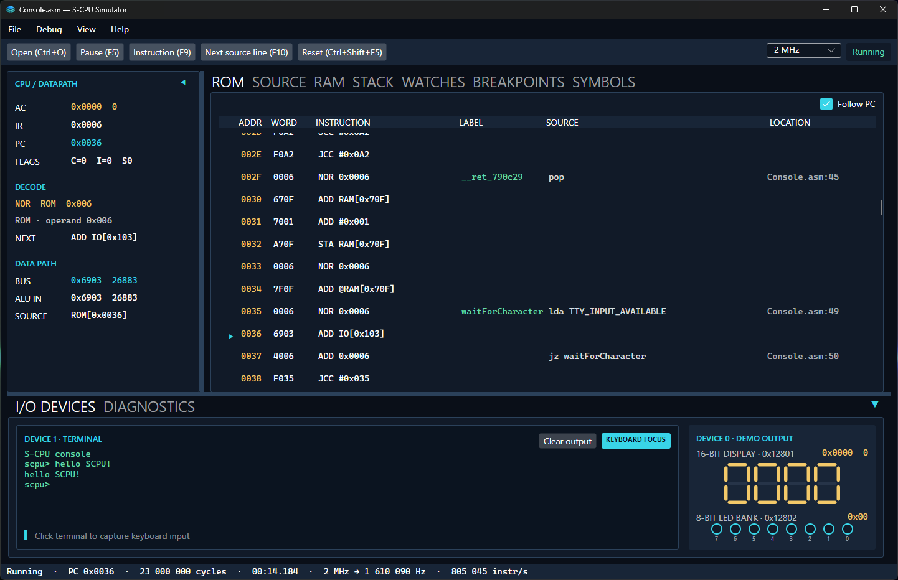
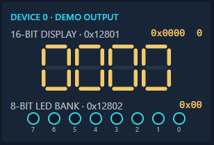
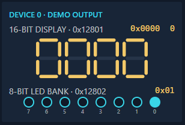
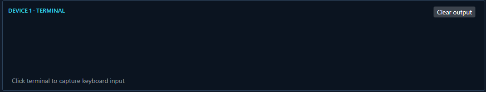

# S-CPU Simulator Desktop

**S-CPU Simulator Desktop** is a graphical simulator and debugger for the educational
16-bit S-CPU.

Open a binary ROM, an assembly file or an S-Code program, then inspect its execution
from the mapped source line down to the generated machine instructions, CPU datapath,
memory and simulated MMIO devices.


* Run binary ROM, assembly and S-Code programs.
* Step by S0/S1 hardware cycle, native instruction or mapped source line.
* Inspect CPU state, ROM, RAM, stack, symbols, watches and breakpoints.
* Interact with the terminal, hexadecimal display and LED bank.

## Debug from source to machine instructions

The ROM and source views remain synchronized with the current program counter. Assembly
source is syntax-highlighted, and generated assembly is shown when an S-Code program is
loaded.

A mapped source line can be expanded to reveal every native instruction it generated,
making macros, calls and compiler output easier to understand. Breakpoints can be added
from the ROM or source gutter, while **Follow PC** keeps the active instruction visible.



The simulator can step one S0/S1 hardware cycle, one complete instruction or the next
mapped source line. It can also stop on HALT or at an address breakpoint.

## Inspect the complete machine state

The collapsible CPU/datapath panel exposes AC, IR, PC, flags, the decoded instruction,
the next instruction, the data bus and the ALU input while a program executes.

RAM can be inspected in hexadecimal, decimal and ASCII forms. By default, the view keeps
the focus on used or labeled memory, while changed values are highlighted between
visible snapshots. The debugger also reconstructs the logical stack from the S-CPU SP and FP conventions.

| RAM inspection | Logical stack |
| --- | --- |
|  |  |

Persistent watches can be added by RAM or MMIO address, label or resolved assembler
constant. MMIO watches are read without consuming device input, and `Ctrl+G` navigates
directly to a ROM/RAM address or symbol.

## Run interactive MMIO programs

The built-in devices reproduce the standard S-CPU simulator memory map:

* Device 1 interactive terminal with character-by-character keyboard input;
* Device 0 four-digit 16-bit hexadecimal display at `0x12801`;
* Device 0 eight-bit LED bank at `0x12802`.

Terminal output can be cleared without changing pending input. A separate diagnostics
view records program loading, execution commands, frequency changes, stops and faults.
Loading a program or resetting the CPU also resets the connected devices.



## MMIO device demos

Small programs demonstrate the simulated MMIO devices in real time.

| Hexadecimal display | LED bank |
| --- | --- |
| [](../../../samples/scode/HexCounter.scode) | [](../../../samples/scode/LEDChaser.scode) |
| [`HexCounter.scode`](../../../samples/scode/HexCounter.scode) increments the 16-bit display. | [`LEDChaser.scode`](../../../samples/scode/LEDChaser.scode) moves a bit across the LED bank. |

[](../../../samples/scode/HelloWorld.scode)

[`HelloWorld.scode`](../../../samples/scode/HelloWorld.scode) runs at **1 kHz**
in this animation so the terminal output appears one character at a time.

See the [`samples`](../../../samples) directory for more assembly and S-Code programs.

## Capabilities

| Area | Features |
| --- | --- |
| Program loading | Binary ROM, assembly and S-Code, automatic assembly or compilation, command-line file opening and reload |
| Execution | Run, pause, reset, restart, cycle step, instruction step and mapped source-line step |
| Debugging | Annotated ROM, source mapping, follow PC, breakpoints and generated instruction expansion |
| Inspection | CPU/datapath state, RAM, logical stack, watches and symbols |
| MMIO | Interactive terminal, 16-bit hexadecimal display and eight-bit LED bank |
| Export | Binary, Intel HEX, Logisim 16, annotated listing, Verilog, Gowin and symbols |
| Performance | Clock presets from 5 Hz to 4 MHz, unthrottled execution and runtime statistics |

## Quick start

Run the packaged desktop simulator:

```powershell
./scpu-simulator
```

Run it from a source checkout:

```powershell
dotnet run --project software/simulator/SCPU.Simulator.Desktop
```

Open a program immediately:

```powershell
# Packaged release
./scpu-simulator samples/asm/HelloWorld.asm

# Source checkout
dotnet run --project software/simulator/SCPU.Simulator.Desktop -- samples/asm/HelloWorld.asm
```

Start with `samples/asm/HelloWorld.asm` for terminal output or
`samples/asm/Console.asm` for interactive keyboard input.

### Command-line options

```text
SCPU.Simulator.Desktop [filepath]
SCPU.Simulator.Desktop --file <filepath> [--frequency <hertz|max>] [--follow-pc|--no-follow-pc]
```

Unknown, duplicate or malformed options are rejected explicitly.

See the [software tool guide](../../README.md#running-the-tools) for packaged tool
requirements and platform-specific invocation.

## Keyboard shortcuts

| Shortcut | Action |
| --- | --- |
| `Ctrl+O` | Open a program |
| `Ctrl+F5` | Reload the current program |
| `F5` | Run or pause |
| `F8` | Step one S0/S1 hardware cycle |
| `F9` | Step one complete instruction |
| `F10` | Step to the next mapped source line |
| `Ctrl+R` | Reset and run |
| `Ctrl+Shift+F5` | Reset the CPU and devices |
| `Ctrl+G` | Go to an address or symbol |
| `Ctrl+B` | Toggle the selected ROM breakpoint |
| `Ctrl+Shift+F9` | Remove all breakpoints |
| `Ctrl+Shift+F10` | Remove all watches |

The mouse back button returns to the previously selected workspace tab.

## Workspace

The workspace contains a collapsible CPU/datapath panel; ROM, source, RAM, stack,
watches, breakpoints and symbols tabs; a collapsible I/O devices and diagnostics panel;
and a permanent execution status bar.

Expanded or collapsed panel states are stored in the current user's local application
data. Splitter sizes are intentionally not persisted so the layout remains usable after
a resolution or Remote Desktop change.

## Architecture

The frontend is separated from the simulation engine so CPU execution, debugger
orchestration and MMIO devices remain reusable from the CLI and future frontends.

* **SCPU.Simulator.Core** — processor, ROM, RAM and CPU execution.
* **SCPU.Simulator.Debugger** — loading, source metadata, symbols, sessions, snapshots,
  breakpoints, exports and the asynchronous runner.
* **SCPU.Simulator.Devices** — UI-independent reusable MMIO devices.
* **SCPU.Simulator.Desktop** — Avalonia views, ViewModels, dialogs and desktop lifecycle.

No Avalonia type is exposed by the Core, Debugger or Devices projects. The execution
runner is cancellable and strictly sequential, while simulation frequency and UI refresh
frequency remain independent so high-speed execution does not redraw the window after
every cycle.
